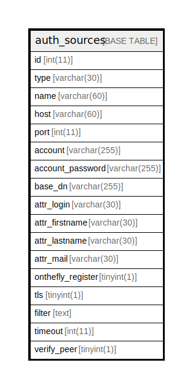

# auth_sources

## 概要

<details>
<summary><strong>テーブル定義</strong></summary>

```sql
CREATE TABLE `auth_sources` (
  `id` int(11) NOT NULL AUTO_INCREMENT,
  `type` varchar(30) NOT NULL DEFAULT '',
  `name` varchar(60) NOT NULL DEFAULT '',
  `host` varchar(60) DEFAULT NULL,
  `port` int(11) DEFAULT NULL,
  `account` varchar(255) DEFAULT NULL,
  `account_password` varchar(255) DEFAULT '',
  `base_dn` varchar(255) DEFAULT NULL,
  `attr_login` varchar(30) DEFAULT NULL,
  `attr_firstname` varchar(30) DEFAULT NULL,
  `attr_lastname` varchar(30) DEFAULT NULL,
  `attr_mail` varchar(30) DEFAULT NULL,
  `onthefly_register` tinyint(1) NOT NULL DEFAULT '0',
  `tls` tinyint(1) NOT NULL DEFAULT '0',
  `filter` text,
  `timeout` int(11) DEFAULT NULL,
  `verify_peer` tinyint(1) NOT NULL DEFAULT '1',
  PRIMARY KEY (`id`),
  KEY `index_auth_sources_on_id_and_type` (`id`,`type`)
) ENGINE=InnoDB DEFAULT CHARSET=utf8
```

</details>

## カラム一覧

| 名前                | タイプ          | デフォルト値       | Nullable | Extra Definition | 子テーブル      | 親テーブル      | コメント     |
| ----------------- | ------------ | ------------ | -------- | ---------------- | ---------- | ---------- | -------- |
| id                | int(11)      |              | false    | auto_increment   |            |            |          |
| type              | varchar(30)  |              | false    |                  |            |            |          |
| name              | varchar(60)  |              | false    |                  |            |            |          |
| host              | varchar(60)  |              | true     |                  |            |            |          |
| port              | int(11)      |              | true     |                  |            |            |          |
| account           | varchar(255) |              | true     |                  |            |            |          |
| account_password  | varchar(255) |              | true     |                  |            |            |          |
| base_dn           | varchar(255) |              | true     |                  |            |            |          |
| attr_login        | varchar(30)  |              | true     |                  |            |            |          |
| attr_firstname    | varchar(30)  |              | true     |                  |            |            |          |
| attr_lastname     | varchar(30)  |              | true     |                  |            |            |          |
| attr_mail         | varchar(30)  |              | true     |                  |            |            |          |
| onthefly_register | tinyint(1)   | 0            | false    |                  |            |            |          |
| tls               | tinyint(1)   | 0            | false    |                  |            |            |          |
| filter            | text         |              | true     |                  |            |            |          |
| timeout           | int(11)      |              | true     |                  |            |            |          |
| verify_peer       | tinyint(1)   | 1            | false    |                  |            |            |          |

## 制約一覧

| 名前      | タイプ         | 定義               |
| ------- | ----------- | ---------------- |
| PRIMARY | PRIMARY KEY | PRIMARY KEY (id) |

## INDEX一覧

| 名前                                | 定義                                                           |
| --------------------------------- | ------------------------------------------------------------ |
| index_auth_sources_on_id_and_type | KEY index_auth_sources_on_id_and_type (id, type) USING BTREE |
| PRIMARY                           | PRIMARY KEY (id) USING BTREE                                 |

## ER図



---

> Generated by [tbls](https://github.com/k1LoW/tbls)
