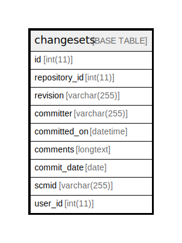

# changesets

## 概要

<details>
<summary><strong>テーブル定義</strong></summary>

```sql
CREATE TABLE `changesets` (
  `id` int(11) NOT NULL AUTO_INCREMENT,
  `repository_id` int(11) NOT NULL,
  `revision` varchar(255) NOT NULL,
  `committer` varchar(255) DEFAULT NULL,
  `committed_on` datetime NOT NULL,
  `comments` longtext,
  `commit_date` date DEFAULT NULL,
  `scmid` varchar(255) DEFAULT NULL,
  `user_id` int(11) DEFAULT NULL,
  PRIMARY KEY (`id`),
  UNIQUE KEY `changesets_repos_rev` (`repository_id`,`revision`),
  KEY `index_changesets_on_user_id` (`user_id`),
  KEY `index_changesets_on_repository_id` (`repository_id`),
  KEY `index_changesets_on_committed_on` (`committed_on`),
  KEY `changesets_repos_scmid` (`repository_id`,`scmid`)
) ENGINE=InnoDB DEFAULT CHARSET=utf8
```

</details>

## カラム一覧

| 名前            | タイプ          | デフォルト値       | NULL許可   | Extra Definition | 子テーブル      | 親テーブル      | コメント     |
| ------------- | ------------ | ------------ | -------- | ---------------- | ---------- | ---------- | -------- |
| id            | int(11)      |              | false    | auto_increment   |            |            |          |
| repository_id | int(11)      |              | false    |                  |            |            |          |
| revision      | varchar(255) |              | false    |                  |            |            |          |
| committer     | varchar(255) |              | true     |                  |            |            |          |
| committed_on  | datetime     |              | false    |                  |            |            |          |
| comments      | longtext     |              | true     |                  |            |            |          |
| commit_date   | date         |              | true     |                  |            |            |          |
| scmid         | varchar(255) |              | true     |                  |            |            |          |
| user_id       | int(11)      |              | true     |                  |            |            |          |

## 制約一覧

| 名前                   | タイプ         | 定義                                                        |
| -------------------- | ----------- | --------------------------------------------------------- |
| changesets_repos_rev | UNIQUE      | UNIQUE KEY changesets_repos_rev (repository_id, revision) |
| PRIMARY              | PRIMARY KEY | PRIMARY KEY (id)                                          |

## INDEX一覧

| 名前                                | 定義                                                                    |
| --------------------------------- | --------------------------------------------------------------------- |
| changesets_repos_scmid            | KEY changesets_repos_scmid (repository_id, scmid) USING BTREE         |
| index_changesets_on_committed_on  | KEY index_changesets_on_committed_on (committed_on) USING BTREE       |
| index_changesets_on_repository_id | KEY index_changesets_on_repository_id (repository_id) USING BTREE     |
| index_changesets_on_user_id       | KEY index_changesets_on_user_id (user_id) USING BTREE                 |
| PRIMARY                           | PRIMARY KEY (id) USING BTREE                                          |
| changesets_repos_rev              | UNIQUE KEY changesets_repos_rev (repository_id, revision) USING BTREE |

## ER図



---

> Generated by [tbls](https://github.com/k1LoW/tbls)
