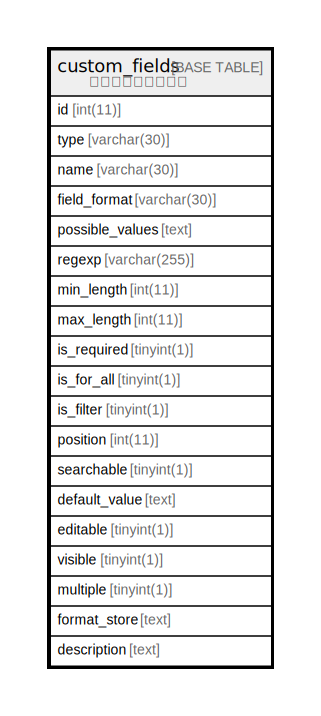

# custom_fields

## 概要

カスタムフィールド

<details>
<summary><strong>テーブル定義</strong></summary>

```sql
CREATE TABLE `custom_fields` (
  `id` int(11) NOT NULL AUTO_INCREMENT,
  `type` varchar(30) NOT NULL DEFAULT '',
  `name` varchar(30) NOT NULL DEFAULT '',
  `field_format` varchar(30) NOT NULL DEFAULT '',
  `possible_values` text,
  `regexp` varchar(255) DEFAULT '',
  `min_length` int(11) DEFAULT NULL,
  `max_length` int(11) DEFAULT NULL,
  `is_required` tinyint(1) NOT NULL DEFAULT '0',
  `is_for_all` tinyint(1) NOT NULL DEFAULT '0',
  `is_filter` tinyint(1) NOT NULL DEFAULT '0',
  `position` int(11) DEFAULT NULL,
  `searchable` tinyint(1) DEFAULT '0',
  `default_value` text,
  `editable` tinyint(1) DEFAULT '1',
  `visible` tinyint(1) NOT NULL DEFAULT '1',
  `multiple` tinyint(1) DEFAULT '0',
  `format_store` text,
  `description` text,
  PRIMARY KEY (`id`),
  KEY `index_custom_fields_on_id_and_type` (`id`,`type`)
) ENGINE=InnoDB DEFAULT CHARSET=utf8
```

</details>

## カラム一覧

| 名前              | タイプ          | デフォルト値       | NULL許可   | Extra Definition | 子テーブル      | 親テーブル      | コメント     |
| --------------- | ------------ | ------------ | -------- | ---------------- | ---------- | ---------- | -------- |
| id              | int(11)      |              | false    | auto_increment   |            |            |          |
| type            | varchar(30)  |              | false    |                  |            |            |          |
| name            | varchar(30)  |              | false    |                  |            |            |          |
| field_format    | varchar(30)  |              | false    |                  |            |            |          |
| possible_values | text         |              | true     |                  |            |            |          |
| regexp          | varchar(255) |              | true     |                  |            |            |          |
| min_length      | int(11)      |              | true     |                  |            |            |          |
| max_length      | int(11)      |              | true     |                  |            |            |          |
| is_required     | tinyint(1)   | 0            | false    |                  |            |            |          |
| is_for_all      | tinyint(1)   | 0            | false    |                  |            |            |          |
| is_filter       | tinyint(1)   | 0            | false    |                  |            |            |          |
| position        | int(11)      |              | true     |                  |            |            |          |
| searchable      | tinyint(1)   | 0            | true     |                  |            |            |          |
| default_value   | text         |              | true     |                  |            |            |          |
| editable        | tinyint(1)   | 1            | true     |                  |            |            |          |
| visible         | tinyint(1)   | 1            | false    |                  |            |            |          |
| multiple        | tinyint(1)   | 0            | true     |                  |            |            |          |
| format_store    | text         |              | true     |                  |            |            |          |
| description     | text         |              | true     |                  |            |            |          |

## 制約一覧

| 名前      | タイプ         | 定義               |
| ------- | ----------- | ---------------- |
| PRIMARY | PRIMARY KEY | PRIMARY KEY (id) |

## INDEX一覧

| 名前                                 | 定義                                                            |
| ---------------------------------- | ------------------------------------------------------------- |
| index_custom_fields_on_id_and_type | KEY index_custom_fields_on_id_and_type (id, type) USING BTREE |
| PRIMARY                            | PRIMARY KEY (id) USING BTREE                                  |

## ER図



---

> Generated by [tbls](https://github.com/k1LoW/tbls)
