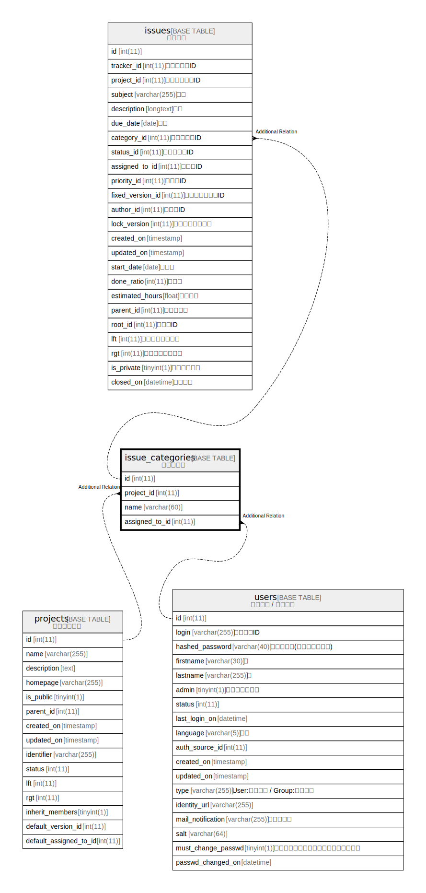

# issue_categories

## 概要

カテゴリー

<details>
<summary><strong>テーブル定義</strong></summary>

```sql
CREATE TABLE `issue_categories` (
  `id` int(11) NOT NULL AUTO_INCREMENT,
  `project_id` int(11) NOT NULL DEFAULT '0',
  `name` varchar(60) NOT NULL DEFAULT '',
  `assigned_to_id` int(11) DEFAULT NULL,
  PRIMARY KEY (`id`),
  KEY `issue_categories_project_id` (`project_id`),
  KEY `index_issue_categories_on_assigned_to_id` (`assigned_to_id`)
) ENGINE=InnoDB DEFAULT CHARSET=utf8
```

</details>

## カラム一覧

| 名前             | タイプ         | デフォルト値       | NULL許可   | Extra Definition | 子テーブル      | 親テーブル      | コメント     |
| -------------- | ----------- | ------------ | -------- | ---------------- | ---------- | ---------- | -------- |
| id             | int(11)     |              | false    | auto_increment   |            |            |          |
| project_id     | int(11)     | 0            | false    |                  |            |            |          |
| name           | varchar(60) |              | false    |                  |            |            |          |
| assigned_to_id | int(11)     |              | true     |                  |            |            |          |

## 制約一覧

| 名前      | タイプ         | 定義               |
| ------- | ----------- | ---------------- |
| PRIMARY | PRIMARY KEY | PRIMARY KEY (id) |

## INDEX一覧

| 名前                                       | 定義                                                                        |
| ---------------------------------------- | ------------------------------------------------------------------------- |
| index_issue_categories_on_assigned_to_id | KEY index_issue_categories_on_assigned_to_id (assigned_to_id) USING BTREE |
| issue_categories_project_id              | KEY issue_categories_project_id (project_id) USING BTREE                  |
| PRIMARY                                  | PRIMARY KEY (id) USING BTREE                                              |

## ER図



---

> Generated by [tbls](https://github.com/k1LoW/tbls)
