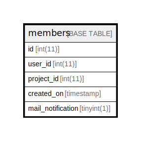

# members

## 概要

<details>
<summary><strong>テーブル定義</strong></summary>

```sql
CREATE TABLE `members` (
  `id` int(11) NOT NULL AUTO_INCREMENT,
  `user_id` int(11) NOT NULL DEFAULT '0',
  `project_id` int(11) NOT NULL DEFAULT '0',
  `created_on` timestamp NULL DEFAULT NULL,
  `mail_notification` tinyint(1) NOT NULL DEFAULT '0',
  PRIMARY KEY (`id`),
  UNIQUE KEY `index_members_on_user_id_and_project_id` (`user_id`,`project_id`),
  KEY `index_members_on_user_id` (`user_id`),
  KEY `index_members_on_project_id` (`project_id`)
) ENGINE=InnoDB AUTO_INCREMENT=[Redacted by tbls] DEFAULT CHARSET=utf8
```

</details>

## カラム一覧

| 名前                | タイプ        | デフォルト値       | NULL許可   | Extra Definition | 子テーブル      | 親テーブル                   | コメント     |
| ----------------- | ---------- | ------------ | -------- | ---------------- | ---------- | ----------------------- | -------- |
| id                | int(11)    |              | false    | auto_increment   |            |                         |          |
| user_id           | int(11)    | 0            | false    |                  |            |                         |          |
| project_id        | int(11)    | 0            | false    |                  |            | [projects](projects.md) |          |
| created_on        | timestamp  |              | true     |                  |            |                         |          |
| mail_notification | tinyint(1) | 0            | false    |                  |            |                         |          |

## 制約一覧

| 名前                                      | タイプ         | 定義                                                                       |
| --------------------------------------- | ----------- | ------------------------------------------------------------------------ |
| index_members_on_user_id_and_project_id | UNIQUE      | UNIQUE KEY index_members_on_user_id_and_project_id (user_id, project_id) |
| PRIMARY                                 | PRIMARY KEY | PRIMARY KEY (id)                                                         |

## INDEX一覧

| 名前                                      | 定義                                                                                   |
| --------------------------------------- | ------------------------------------------------------------------------------------ |
| index_members_on_project_id             | KEY index_members_on_project_id (project_id) USING BTREE                             |
| index_members_on_user_id                | KEY index_members_on_user_id (user_id) USING BTREE                                   |
| PRIMARY                                 | PRIMARY KEY (id) USING BTREE                                                         |
| index_members_on_user_id_and_project_id | UNIQUE KEY index_members_on_user_id_and_project_id (user_id, project_id) USING BTREE |

## ER図



---

> Generated by [tbls](https://github.com/k1LoW/tbls)
