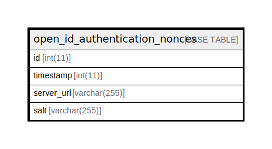

# open_id_authentication_nonces

## 概要

<details>
<summary><strong>テーブル定義</strong></summary>

```sql
CREATE TABLE `open_id_authentication_nonces` (
  `id` int(11) NOT NULL AUTO_INCREMENT,
  `timestamp` int(11) NOT NULL,
  `server_url` varchar(255) DEFAULT NULL,
  `salt` varchar(255) NOT NULL,
  PRIMARY KEY (`id`)
) ENGINE=InnoDB DEFAULT CHARSET=utf8
```

</details>

## カラム一覧

| 名前         | タイプ          | デフォルト値       | Nullable | Extra Definition | 子テーブル      | 親テーブル      | コメント     |
| ---------- | ------------ | ------------ | -------- | ---------------- | ---------- | ---------- | -------- |
| id         | int(11)      |              | false    | auto_increment   |            |            |          |
| timestamp  | int(11)      |              | false    |                  |            |            |          |
| server_url | varchar(255) |              | true     |                  |            |            |          |
| salt       | varchar(255) |              | false    |                  |            |            |          |

## 制約一覧

| 名前      | タイプ         | 定義               |
| ------- | ----------- | ---------------- |
| PRIMARY | PRIMARY KEY | PRIMARY KEY (id) |

## INDEX一覧

| 名前      | 定義                           |
| ------- | ---------------------------- |
| PRIMARY | PRIMARY KEY (id) USING BTREE |

## ER図



---

> Generated by [tbls](https://github.com/k1LoW/tbls)
