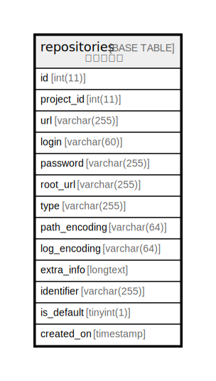

# repositories

## 概要

<details>
<summary><strong>テーブル定義</strong></summary>

```sql
CREATE TABLE `repositories` (
  `id` int(11) NOT NULL AUTO_INCREMENT,
  `project_id` int(11) NOT NULL DEFAULT '0',
  `url` varchar(255) NOT NULL DEFAULT '',
  `login` varchar(60) DEFAULT '',
  `password` varchar(255) DEFAULT '',
  `root_url` varchar(255) DEFAULT '',
  `type` varchar(255) DEFAULT NULL,
  `path_encoding` varchar(64) DEFAULT NULL,
  `log_encoding` varchar(64) DEFAULT NULL,
  `extra_info` longtext,
  `identifier` varchar(255) DEFAULT NULL,
  `is_default` tinyint(1) DEFAULT '0',
  `created_on` timestamp NULL DEFAULT NULL,
  PRIMARY KEY (`id`),
  KEY `index_repositories_on_project_id` (`project_id`)
) ENGINE=InnoDB DEFAULT CHARSET=utf8
```

</details>

## カラム一覧

| 名前            | タイプ          | デフォルト値       | Nullable | Extra Definition | 子テーブル      | 親テーブル      | コメント     |
| ------------- | ------------ | ------------ | -------- | ---------------- | ---------- | ---------- | -------- |
| id            | int(11)      |              | false    | auto_increment   |            |            |          |
| project_id    | int(11)      | 0            | false    |                  |            |            |          |
| url           | varchar(255) |              | false    |                  |            |            |          |
| login         | varchar(60)  |              | true     |                  |            |            |          |
| password      | varchar(255) |              | true     |                  |            |            |          |
| root_url      | varchar(255) |              | true     |                  |            |            |          |
| type          | varchar(255) |              | true     |                  |            |            |          |
| path_encoding | varchar(64)  |              | true     |                  |            |            |          |
| log_encoding  | varchar(64)  |              | true     |                  |            |            |          |
| extra_info    | longtext     |              | true     |                  |            |            |          |
| identifier    | varchar(255) |              | true     |                  |            |            |          |
| is_default    | tinyint(1)   | 0            | true     |                  |            |            |          |
| created_on    | timestamp    |              | true     |                  |            |            |          |

## 制約一覧

| 名前      | タイプ         | 定義               |
| ------- | ----------- | ---------------- |
| PRIMARY | PRIMARY KEY | PRIMARY KEY (id) |

## INDEX一覧

| 名前                               | 定義                                                            |
| -------------------------------- | ------------------------------------------------------------- |
| index_repositories_on_project_id | KEY index_repositories_on_project_id (project_id) USING BTREE |
| PRIMARY                          | PRIMARY KEY (id) USING BTREE                                  |

## ER図



---

> Generated by [tbls](https://github.com/k1LoW/tbls)
