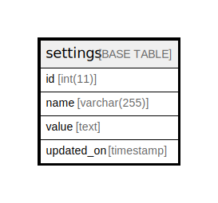

# settings

## 概要

設定

<details>
<summary><strong>テーブル定義</strong></summary>

```sql
CREATE TABLE `settings` (
  `id` int(11) NOT NULL AUTO_INCREMENT,
  `name` varchar(255) NOT NULL DEFAULT '',
  `value` text,
  `updated_on` timestamp NULL DEFAULT NULL,
  PRIMARY KEY (`id`),
  KEY `index_settings_on_name` (`name`)
) ENGINE=InnoDB AUTO_INCREMENT=[Redacted by tbls] DEFAULT CHARSET=utf8
```

</details>

## カラム一覧

| 名前         | タイプ          | デフォルト値       | NULL許可   | Extra Definition | 子テーブル      | 親テーブル      | コメント     |
| ---------- | ------------ | ------------ | -------- | ---------------- | ---------- | ---------- | -------- |
| id         | int(11)      |              | false    | auto_increment   |            |            |          |
| name       | varchar(255) |              | false    |                  |            |            |          |
| value      | text         |              | true     |                  |            |            |          |
| updated_on | timestamp    |              | true     |                  |            |            |          |

## 制約一覧

| 名前      | タイプ         | 定義               |
| ------- | ----------- | ---------------- |
| PRIMARY | PRIMARY KEY | PRIMARY KEY (id) |

## INDEX一覧

| 名前                     | 定義                                            |
| ---------------------- | --------------------------------------------- |
| index_settings_on_name | KEY index_settings_on_name (name) USING BTREE |
| PRIMARY                | PRIMARY KEY (id) USING BTREE                  |

## ER図



---

> Generated by [tbls](https://github.com/k1LoW/tbls)
