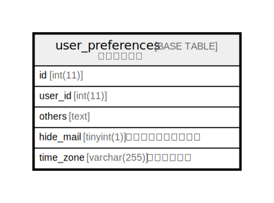

# user_preferences

## 概要

<details>
<summary><strong>テーブル定義</strong></summary>

```sql
CREATE TABLE `user_preferences` (
  `id` int(11) NOT NULL AUTO_INCREMENT,
  `user_id` int(11) NOT NULL DEFAULT '0',
  `others` text,
  `hide_mail` tinyint(1) DEFAULT '1',
  `time_zone` varchar(255) DEFAULT NULL,
  PRIMARY KEY (`id`),
  KEY `index_user_preferences_on_user_id` (`user_id`)
) ENGINE=InnoDB AUTO_INCREMENT=[Redacted by tbls] DEFAULT CHARSET=utf8
```

</details>

## カラム一覧

| 名前        | タイプ          | デフォルト値       | Nullable | Extra Definition | 子テーブル      | 親テーブル      | コメント     |
| --------- | ------------ | ------------ | -------- | ---------------- | ---------- | ---------- | -------- |
| id        | int(11)      |              | false    | auto_increment   |            |            |          |
| user_id   | int(11)      | 0            | false    |                  |            |            |          |
| others    | text         |              | true     |                  |            |            |          |
| hide_mail | tinyint(1)   | 1            | true     |                  |            |            |          |
| time_zone | varchar(255) |              | true     |                  |            |            |          |

## 制約一覧

| 名前      | タイプ         | 定義               |
| ------- | ----------- | ---------------- |
| PRIMARY | PRIMARY KEY | PRIMARY KEY (id) |

## INDEX一覧

| 名前                                | 定義                                                          |
| --------------------------------- | ----------------------------------------------------------- |
| index_user_preferences_on_user_id | KEY index_user_preferences_on_user_id (user_id) USING BTREE |
| PRIMARY                           | PRIMARY KEY (id) USING BTREE                                |

## ER図



---

> Generated by [tbls](https://github.com/k1LoW/tbls)
