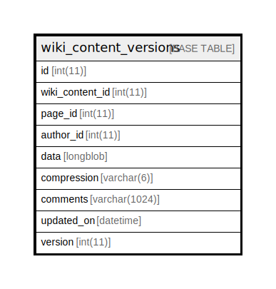

# wiki_content_versions

## 概要

<details>
<summary><strong>テーブル定義</strong></summary>

```sql
CREATE TABLE `wiki_content_versions` (
  `id` int(11) NOT NULL AUTO_INCREMENT,
  `wiki_content_id` int(11) NOT NULL,
  `page_id` int(11) NOT NULL,
  `author_id` int(11) DEFAULT NULL,
  `data` longblob,
  `compression` varchar(6) DEFAULT '',
  `comments` varchar(1024) DEFAULT '',
  `updated_on` datetime NOT NULL,
  `version` int(11) NOT NULL,
  PRIMARY KEY (`id`),
  KEY `wiki_content_versions_wcid` (`wiki_content_id`),
  KEY `index_wiki_content_versions_on_updated_on` (`updated_on`)
) ENGINE=InnoDB DEFAULT CHARSET=utf8
```

</details>

## カラム一覧

| 名前              | タイプ           | デフォルト値       | Nullable | Extra Definition | 子テーブル      | 親テーブル      | コメント     |
| --------------- | ------------- | ------------ | -------- | ---------------- | ---------- | ---------- | -------- |
| id              | int(11)       |              | false    | auto_increment   |            |            |          |
| wiki_content_id | int(11)       |              | false    |                  |            |            |          |
| page_id         | int(11)       |              | false    |                  |            |            |          |
| author_id       | int(11)       |              | true     |                  |            |            |          |
| data            | longblob      |              | true     |                  |            |            |          |
| compression     | varchar(6)    |              | true     |                  |            |            |          |
| comments        | varchar(1024) |              | true     |                  |            |            |          |
| updated_on      | datetime      |              | false    |                  |            |            |          |
| version         | int(11)       |              | false    |                  |            |            |          |

## 制約一覧

| 名前      | タイプ         | 定義               |
| ------- | ----------- | ---------------- |
| PRIMARY | PRIMARY KEY | PRIMARY KEY (id) |

## INDEX一覧

| 名前                                        | 定義                                                                     |
| ----------------------------------------- | ---------------------------------------------------------------------- |
| index_wiki_content_versions_on_updated_on | KEY index_wiki_content_versions_on_updated_on (updated_on) USING BTREE |
| wiki_content_versions_wcid                | KEY wiki_content_versions_wcid (wiki_content_id) USING BTREE           |
| PRIMARY                                   | PRIMARY KEY (id) USING BTREE                                           |

## ER図



---

> Generated by [tbls](https://github.com/k1LoW/tbls)
