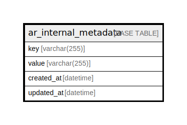

# ar_internal_metadata

## 概要

<details>
<summary><strong>テーブル定義</strong></summary>

```sql
CREATE TABLE `ar_internal_metadata` (
  `key` varchar(255) CHARACTER SET utf8 NOT NULL,
  `value` varchar(255) DEFAULT NULL,
  `created_at` datetime NOT NULL,
  `updated_at` datetime NOT NULL,
  PRIMARY KEY (`key`)
) ENGINE=InnoDB DEFAULT CHARSET=utf8mb4
```

</details>

## カラム一覧

| 名前         | タイプ          | デフォルト値       | NULL許可   | 子テーブル      | 親テーブル      | コメント     |
| ---------- | ------------ | ------------ | -------- | ---------- | ---------- | -------- |
| key        | varchar(255) |              | false    |            |            |          |
| value      | varchar(255) | NULL         | true     |            |            |          |
| created_at | datetime     |              | false    |            |            |          |
| updated_at | datetime     |              | false    |            |            |          |

## 制約一覧

| 名前      | タイプ         | 定義                |
| ------- | ----------- | ----------------- |
| PRIMARY | PRIMARY KEY | PRIMARY KEY (key) |

## INDEX一覧

| 名前      | 定義                            |
| ------- | ----------------------------- |
| PRIMARY | PRIMARY KEY (key) USING BTREE |

## ER図



---

> Generated by [tbls](https://github.com/k1LoW/tbls)
