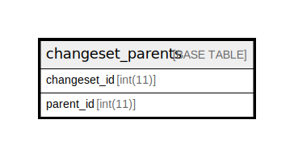

# changeset_parents

## 概要

<details>
<summary><strong>テーブル定義</strong></summary>

```sql
CREATE TABLE `changeset_parents` (
  `changeset_id` int(11) NOT NULL,
  `parent_id` int(11) NOT NULL,
  KEY `changeset_parents_changeset_ids` (`changeset_id`),
  KEY `changeset_parents_parent_ids` (`parent_id`)
) ENGINE=InnoDB DEFAULT CHARSET=utf8
```

</details>

## カラム一覧

| 名前           | タイプ     | デフォルト値       | Nullable | 子テーブル      | 親テーブル      | コメント     |
| ------------ | ------- | ------------ | -------- | ---------- | ---------- | -------- |
| changeset_id | int(11) |              | false    |            |            |          |
| parent_id    | int(11) |              | false    |            |            |          |

## INDEX一覧

| 名前                              | 定義                                                             |
| ------------------------------- | -------------------------------------------------------------- |
| changeset_parents_changeset_ids | KEY changeset_parents_changeset_ids (changeset_id) USING BTREE |
| changeset_parents_parent_ids    | KEY changeset_parents_parent_ids (parent_id) USING BTREE       |

## ER図



---

> Generated by [tbls](https://github.com/k1LoW/tbls)
