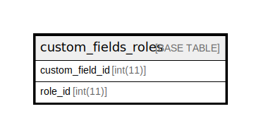

# custom_fields_roles

## 概要

カスタムフィールド⇔ロール

<details>
<summary><strong>テーブル定義</strong></summary>

```sql
CREATE TABLE `custom_fields_roles` (
  `custom_field_id` int(11) NOT NULL,
  `role_id` int(11) NOT NULL,
  UNIQUE KEY `custom_fields_roles_ids` (`custom_field_id`,`role_id`)
) ENGINE=InnoDB DEFAULT CHARSET=utf8mb4
```

</details>

## カラム一覧

| 名前              | タイプ     | デフォルト値       | NULL許可   | 子テーブル      | 親テーブル                             | コメント     |
| --------------- | ------- | ------------ | -------- | ---------- | --------------------------------- | -------- |
| custom_field_id | int(11) |              | false    |            | [custom_fields](custom_fields.md) |          |
| role_id         | int(11) |              | false    |            | [roles](roles.md)                 |          |

## 制約一覧

| 名前                      | タイプ    | 定義                                                            |
| ----------------------- | ------ | ------------------------------------------------------------- |
| custom_fields_roles_ids | UNIQUE | UNIQUE KEY custom_fields_roles_ids (custom_field_id, role_id) |

## INDEX一覧

| 名前                      | 定義                                                                        |
| ----------------------- | ------------------------------------------------------------------------- |
| custom_fields_roles_ids | UNIQUE KEY custom_fields_roles_ids (custom_field_id, role_id) USING BTREE |

## ER図



---

> Generated by [tbls](https://github.com/k1LoW/tbls)
