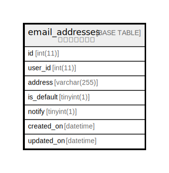

# email_addresses

## 概要

<details>
<summary><strong>テーブル定義</strong></summary>

```sql
CREATE TABLE `email_addresses` (
  `id` int(11) NOT NULL AUTO_INCREMENT,
  `user_id` int(11) NOT NULL,
  `address` varchar(255) NOT NULL,
  `is_default` tinyint(1) NOT NULL DEFAULT '0',
  `notify` tinyint(1) NOT NULL DEFAULT '1',
  `created_on` datetime NOT NULL,
  `updated_on` datetime NOT NULL,
  PRIMARY KEY (`id`),
  KEY `index_email_addresses_on_user_id` (`user_id`)
) ENGINE=InnoDB AUTO_INCREMENT=[Redacted by tbls] DEFAULT CHARSET=utf8
```

</details>

## カラム一覧

| 名前         | タイプ          | デフォルト値       | Nullable | Extra Definition | 子テーブル      | 親テーブル      | コメント     |
| ---------- | ------------ | ------------ | -------- | ---------------- | ---------- | ---------- | -------- |
| id         | int(11)      |              | false    | auto_increment   |            |            |          |
| user_id    | int(11)      |              | false    |                  |            |            |          |
| address    | varchar(255) |              | false    |                  |            |            |          |
| is_default | tinyint(1)   | 0            | false    |                  |            |            |          |
| notify     | tinyint(1)   | 1            | false    |                  |            |            |          |
| created_on | datetime     |              | false    |                  |            |            |          |
| updated_on | datetime     |              | false    |                  |            |            |          |

## 制約一覧

| 名前      | タイプ         | 定義               |
| ------- | ----------- | ---------------- |
| PRIMARY | PRIMARY KEY | PRIMARY KEY (id) |

## INDEX一覧

| 名前                               | 定義                                                         |
| -------------------------------- | ---------------------------------------------------------- |
| index_email_addresses_on_user_id | KEY index_email_addresses_on_user_id (user_id) USING BTREE |
| PRIMARY                          | PRIMARY KEY (id) USING BTREE                               |

## ER図



---

> Generated by [tbls](https://github.com/k1LoW/tbls)
