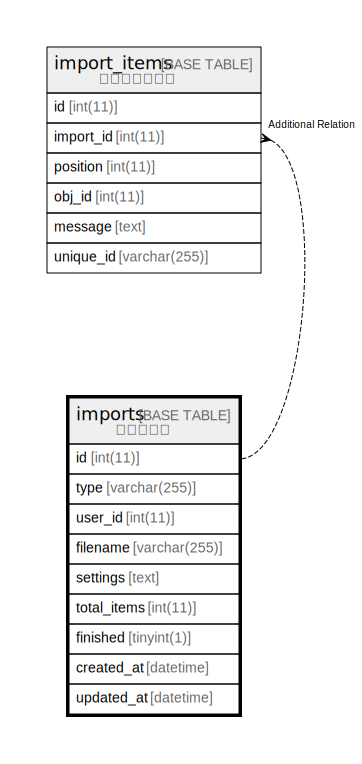

# imports

## 概要

インポート

<details>
<summary><strong>テーブル定義</strong></summary>

```sql
CREATE TABLE `imports` (
  `id` int(11) NOT NULL AUTO_INCREMENT,
  `type` varchar(255) DEFAULT NULL,
  `user_id` int(11) NOT NULL,
  `filename` varchar(255) DEFAULT NULL,
  `settings` text,
  `total_items` int(11) DEFAULT NULL,
  `finished` tinyint(1) NOT NULL DEFAULT '0',
  `created_at` datetime NOT NULL,
  `updated_at` datetime NOT NULL,
  PRIMARY KEY (`id`)
) ENGINE=InnoDB DEFAULT CHARSET=utf8
```

</details>

## カラム一覧

| 名前          | タイプ          | デフォルト値       | NULL許可   | Extra Definition | 子テーブル                           | 親テーブル      | コメント     |
| ----------- | ------------ | ------------ | -------- | ---------------- | ------------------------------- | ---------- | -------- |
| id          | int(11)      |              | false    | auto_increment   | [import_items](import_items.md) |            |          |
| type        | varchar(255) |              | true     |                  |                                 |            |          |
| user_id     | int(11)      |              | false    |                  |                                 |            |          |
| filename    | varchar(255) |              | true     |                  |                                 |            |          |
| settings    | text         |              | true     |                  |                                 |            |          |
| total_items | int(11)      |              | true     |                  |                                 |            |          |
| finished    | tinyint(1)   | 0            | false    |                  |                                 |            |          |
| created_at  | datetime     |              | false    |                  |                                 |            |          |
| updated_at  | datetime     |              | false    |                  |                                 |            |          |

## 制約一覧

| 名前      | タイプ         | 定義               |
| ------- | ----------- | ---------------- |
| PRIMARY | PRIMARY KEY | PRIMARY KEY (id) |

## INDEX一覧

| 名前      | 定義                           |
| ------- | ---------------------------- |
| PRIMARY | PRIMARY KEY (id) USING BTREE |

## ER図



---

> Generated by [tbls](https://github.com/k1LoW/tbls)
