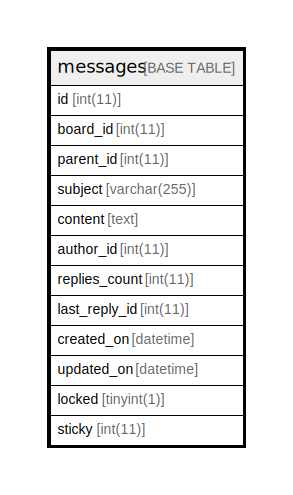

# messages

## 概要

<details>
<summary><strong>テーブル定義</strong></summary>

```sql
CREATE TABLE `messages` (
  `id` int(11) NOT NULL AUTO_INCREMENT,
  `board_id` int(11) NOT NULL,
  `parent_id` int(11) DEFAULT NULL,
  `subject` varchar(255) NOT NULL DEFAULT '',
  `content` text,
  `author_id` int(11) DEFAULT NULL,
  `replies_count` int(11) NOT NULL DEFAULT '0',
  `last_reply_id` int(11) DEFAULT NULL,
  `created_on` datetime NOT NULL,
  `updated_on` datetime NOT NULL,
  `locked` tinyint(1) DEFAULT '0',
  `sticky` int(11) DEFAULT '0',
  PRIMARY KEY (`id`),
  KEY `messages_board_id` (`board_id`),
  KEY `messages_parent_id` (`parent_id`),
  KEY `index_messages_on_last_reply_id` (`last_reply_id`),
  KEY `index_messages_on_author_id` (`author_id`),
  KEY `index_messages_on_created_on` (`created_on`)
) ENGINE=InnoDB DEFAULT CHARSET=utf8
```

</details>

## カラム一覧

| 名前            | タイプ          | デフォルト値       | NULL許可   | Extra Definition | 子テーブル      | 親テーブル      | コメント     |
| ------------- | ------------ | ------------ | -------- | ---------------- | ---------- | ---------- | -------- |
| id            | int(11)      |              | false    | auto_increment   |            |            |          |
| board_id      | int(11)      |              | false    |                  |            |            |          |
| parent_id     | int(11)      |              | true     |                  |            |            |          |
| subject       | varchar(255) |              | false    |                  |            |            |          |
| content       | text         |              | true     |                  |            |            |          |
| author_id     | int(11)      |              | true     |                  |            |            |          |
| replies_count | int(11)      | 0            | false    |                  |            |            |          |
| last_reply_id | int(11)      |              | true     |                  |            |            |          |
| created_on    | datetime     |              | false    |                  |            |            |          |
| updated_on    | datetime     |              | false    |                  |            |            |          |
| locked        | tinyint(1)   | 0            | true     |                  |            |            |          |
| sticky        | int(11)      | 0            | true     |                  |            |            |          |

## 制約一覧

| 名前      | タイプ         | 定義               |
| ------- | ----------- | ---------------- |
| PRIMARY | PRIMARY KEY | PRIMARY KEY (id) |

## INDEX一覧

| 名前                              | 定義                                                              |
| ------------------------------- | --------------------------------------------------------------- |
| index_messages_on_author_id     | KEY index_messages_on_author_id (author_id) USING BTREE         |
| index_messages_on_created_on    | KEY index_messages_on_created_on (created_on) USING BTREE       |
| index_messages_on_last_reply_id | KEY index_messages_on_last_reply_id (last_reply_id) USING BTREE |
| messages_board_id               | KEY messages_board_id (board_id) USING BTREE                    |
| messages_parent_id              | KEY messages_parent_id (parent_id) USING BTREE                  |
| PRIMARY                         | PRIMARY KEY (id) USING BTREE                                    |

## ER図



---

> Generated by [tbls](https://github.com/k1LoW/tbls)
