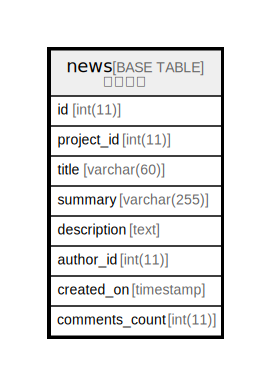

# news

## 概要

ニュース

<details>
<summary><strong>テーブル定義</strong></summary>

```sql
CREATE TABLE `news` (
  `id` int(11) NOT NULL AUTO_INCREMENT,
  `project_id` int(11) DEFAULT NULL,
  `title` varchar(60) NOT NULL DEFAULT '',
  `summary` varchar(255) DEFAULT '',
  `description` text,
  `author_id` int(11) NOT NULL DEFAULT '0',
  `created_on` timestamp NULL DEFAULT NULL,
  `comments_count` int(11) NOT NULL DEFAULT '0',
  PRIMARY KEY (`id`),
  KEY `news_project_id` (`project_id`),
  KEY `index_news_on_author_id` (`author_id`),
  KEY `index_news_on_created_on` (`created_on`)
) ENGINE=InnoDB DEFAULT CHARSET=utf8
```

</details>

## カラム一覧

| 名前             | タイプ          | デフォルト値       | NULL許可   | Extra Definition | 子テーブル      | 親テーブル      | コメント     |
| -------------- | ------------ | ------------ | -------- | ---------------- | ---------- | ---------- | -------- |
| id             | int(11)      |              | false    | auto_increment   |            |            |          |
| project_id     | int(11)      |              | true     |                  |            |            |          |
| title          | varchar(60)  |              | false    |                  |            |            |          |
| summary        | varchar(255) |              | true     |                  |            |            |          |
| description    | text         |              | true     |                  |            |            |          |
| author_id      | int(11)      | 0            | false    |                  |            |            |          |
| created_on     | timestamp    |              | true     |                  |            |            |          |
| comments_count | int(11)      | 0            | false    |                  |            |            |          |

## 制約一覧

| 名前      | タイプ         | 定義               |
| ------- | ----------- | ---------------- |
| PRIMARY | PRIMARY KEY | PRIMARY KEY (id) |

## INDEX一覧

| 名前                       | 定義                                                    |
| ------------------------ | ----------------------------------------------------- |
| index_news_on_author_id  | KEY index_news_on_author_id (author_id) USING BTREE   |
| index_news_on_created_on | KEY index_news_on_created_on (created_on) USING BTREE |
| news_project_id          | KEY news_project_id (project_id) USING BTREE          |
| PRIMARY                  | PRIMARY KEY (id) USING BTREE                          |

## ER図



---

> Generated by [tbls](https://github.com/k1LoW/tbls)
