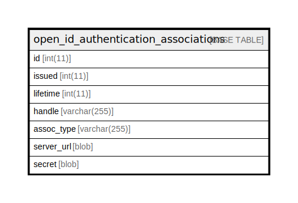

# open_id_authentication_associations

## 概要

<details>
<summary><strong>テーブル定義</strong></summary>

```sql
CREATE TABLE `open_id_authentication_associations` (
  `id` int(11) NOT NULL AUTO_INCREMENT,
  `issued` int(11) DEFAULT NULL,
  `lifetime` int(11) DEFAULT NULL,
  `handle` varchar(255) DEFAULT NULL,
  `assoc_type` varchar(255) DEFAULT NULL,
  `server_url` blob DEFAULT NULL,
  `secret` blob DEFAULT NULL,
  PRIMARY KEY (`id`)
) ENGINE=InnoDB DEFAULT CHARSET=utf8mb4
```

</details>

## カラム一覧

| 名前         | タイプ          | デフォルト値       | NULL許可   | Extra Definition | 子テーブル      | 親テーブル      | コメント     |
| ---------- | ------------ | ------------ | -------- | ---------------- | ---------- | ---------- | -------- |
| id         | int(11)      |              | false    | auto_increment   |            |            |          |
| issued     | int(11)      | NULL         | true     |                  |            |            |          |
| lifetime   | int(11)      | NULL         | true     |                  |            |            |          |
| handle     | varchar(255) | NULL         | true     |                  |            |            |          |
| assoc_type | varchar(255) | NULL         | true     |                  |            |            |          |
| server_url | blob         | NULL         | true     |                  |            |            |          |
| secret     | blob         | NULL         | true     |                  |            |            |          |

## 制約一覧

| 名前      | タイプ         | 定義               |
| ------- | ----------- | ---------------- |
| PRIMARY | PRIMARY KEY | PRIMARY KEY (id) |

## INDEX一覧

| 名前      | 定義                           |
| ------- | ---------------------------- |
| PRIMARY | PRIMARY KEY (id) USING BTREE |

## ER図



---

> Generated by [tbls](https://github.com/k1LoW/tbls)
