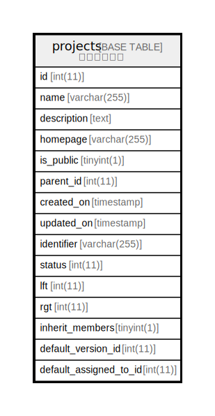

# projects

## 概要

<details>
<summary><strong>テーブル定義</strong></summary>

```sql
CREATE TABLE `projects` (
  `id` int(11) NOT NULL AUTO_INCREMENT,
  `name` varchar(255) NOT NULL DEFAULT '',
  `description` text,
  `homepage` varchar(255) DEFAULT '',
  `is_public` tinyint(1) NOT NULL DEFAULT '1',
  `parent_id` int(11) DEFAULT NULL,
  `created_on` timestamp NULL DEFAULT NULL,
  `updated_on` timestamp NULL DEFAULT NULL,
  `identifier` varchar(255) DEFAULT NULL,
  `status` int(11) NOT NULL DEFAULT '1',
  `lft` int(11) DEFAULT NULL,
  `rgt` int(11) DEFAULT NULL,
  `inherit_members` tinyint(1) NOT NULL DEFAULT '0',
  `default_version_id` int(11) DEFAULT NULL,
  `default_assigned_to_id` int(11) DEFAULT NULL,
  PRIMARY KEY (`id`),
  KEY `index_projects_on_lft` (`lft`),
  KEY `index_projects_on_rgt` (`rgt`)
) ENGINE=InnoDB AUTO_INCREMENT=[Redacted by tbls] DEFAULT CHARSET=utf8
```

</details>

## カラム一覧

| 名前                     | タイプ          | デフォルト値       | Nullable | Extra Definition | 子テーブル      | 親テーブル      | コメント     |
| ---------------------- | ------------ | ------------ | -------- | ---------------- | ---------- | ---------- | -------- |
| id                     | int(11)      |              | false    | auto_increment   |            |            |          |
| name                   | varchar(255) |              | false    |                  |            |            |          |
| description            | text         |              | true     |                  |            |            |          |
| homepage               | varchar(255) |              | true     |                  |            |            |          |
| is_public              | tinyint(1)   | 1            | false    |                  |            |            |          |
| parent_id              | int(11)      |              | true     |                  |            |            |          |
| created_on             | timestamp    |              | true     |                  |            |            |          |
| updated_on             | timestamp    |              | true     |                  |            |            |          |
| identifier             | varchar(255) |              | true     |                  |            |            |          |
| status                 | int(11)      | 1            | false    |                  |            |            |          |
| lft                    | int(11)      |              | true     |                  |            |            |          |
| rgt                    | int(11)      |              | true     |                  |            |            |          |
| inherit_members        | tinyint(1)   | 0            | false    |                  |            |            |          |
| default_version_id     | int(11)      |              | true     |                  |            |            |          |
| default_assigned_to_id | int(11)      |              | true     |                  |            |            |          |

## 制約一覧

| 名前      | タイプ         | 定義               |
| ------- | ----------- | ---------------- |
| PRIMARY | PRIMARY KEY | PRIMARY KEY (id) |

## INDEX一覧

| 名前                    | 定義                                          |
| --------------------- | ------------------------------------------- |
| index_projects_on_lft | KEY index_projects_on_lft (lft) USING BTREE |
| index_projects_on_rgt | KEY index_projects_on_rgt (rgt) USING BTREE |
| PRIMARY               | PRIMARY KEY (id) USING BTREE                |

## ER図



---

> Generated by [tbls](https://github.com/k1LoW/tbls)
