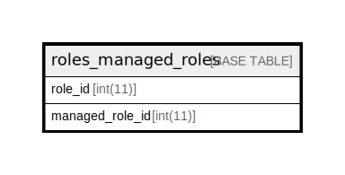

# roles_managed_roles

## 概要

<details>
<summary><strong>テーブル定義</strong></summary>

```sql
CREATE TABLE `roles_managed_roles` (
  `role_id` int(11) NOT NULL,
  `managed_role_id` int(11) NOT NULL,
  UNIQUE KEY `index_roles_managed_roles_on_role_id_and_managed_role_id` (`role_id`,`managed_role_id`)
) ENGINE=InnoDB DEFAULT CHARSET=utf8mb4
```

</details>

## カラム一覧

| 名前              | タイプ     | デフォルト値       | NULL許可   | 子テーブル      | 親テーブル             | コメント     |
| --------------- | ------- | ------------ | -------- | ---------- | ----------------- | -------- |
| role_id         | int(11) |              | false    |            | [roles](roles.md) |          |
| managed_role_id | int(11) |              | false    |            |                   |          |

## 制約一覧

| 名前                                                       | タイプ    | 定義                                                                                             |
| -------------------------------------------------------- | ------ | ---------------------------------------------------------------------------------------------- |
| index_roles_managed_roles_on_role_id_and_managed_role_id | UNIQUE | UNIQUE KEY index_roles_managed_roles_on_role_id_and_managed_role_id (role_id, managed_role_id) |

## INDEX一覧

| 名前                                                       | 定義                                                                                                         |
| -------------------------------------------------------- | ---------------------------------------------------------------------------------------------------------- |
| index_roles_managed_roles_on_role_id_and_managed_role_id | UNIQUE KEY index_roles_managed_roles_on_role_id_and_managed_role_id (role_id, managed_role_id) USING BTREE |

## ER図



---

> Generated by [tbls](https://github.com/k1LoW/tbls)
