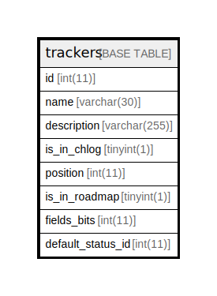

# trackers

## 概要

<details>
<summary><strong>テーブル定義</strong></summary>

```sql
CREATE TABLE `trackers` (
  `id` int(11) NOT NULL AUTO_INCREMENT,
  `name` varchar(30) NOT NULL DEFAULT '',
  `description` varchar(255) DEFAULT NULL,
  `is_in_chlog` tinyint(1) NOT NULL DEFAULT '0',
  `position` int(11) DEFAULT NULL,
  `is_in_roadmap` tinyint(1) NOT NULL DEFAULT '1',
  `fields_bits` int(11) DEFAULT '0',
  `default_status_id` int(11) DEFAULT NULL,
  PRIMARY KEY (`id`)
) ENGINE=InnoDB AUTO_INCREMENT=[Redacted by tbls] DEFAULT CHARSET=utf8
```

</details>

## カラム一覧

| 名前                | タイプ          | デフォルト値       | Nullable | Extra Definition | 子テーブル      | 親テーブル      | コメント     |
| ----------------- | ------------ | ------------ | -------- | ---------------- | ---------- | ---------- | -------- |
| id                | int(11)      |              | false    | auto_increment   |            |            |          |
| name              | varchar(30)  |              | false    |                  |            |            |          |
| description       | varchar(255) |              | true     |                  |            |            |          |
| is_in_chlog       | tinyint(1)   | 0            | false    |                  |            |            |          |
| position          | int(11)      |              | true     |                  |            |            |          |
| is_in_roadmap     | tinyint(1)   | 1            | false    |                  |            |            |          |
| fields_bits       | int(11)      | 0            | true     |                  |            |            |          |
| default_status_id | int(11)      |              | true     |                  |            |            |          |

## 制約一覧

| 名前      | タイプ         | 定義               |
| ------- | ----------- | ---------------- |
| PRIMARY | PRIMARY KEY | PRIMARY KEY (id) |

## INDEX一覧

| 名前      | 定義                           |
| ------- | ---------------------------- |
| PRIMARY | PRIMARY KEY (id) USING BTREE |

## ER図



---

> Generated by [tbls](https://github.com/k1LoW/tbls)
