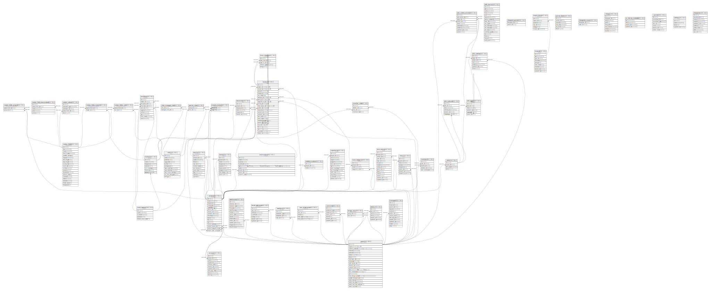

# Redmine

## テーブル一覧

| 名前                                                        | カラム一覧      | コメント                             | タイプ        |
| --------------------------------------------------------- | ---------- | -------------------------------- | ---------- |
| [custom_field_enumerations](custom_field_enumerations.md) | 5          |                                  | BASE TABLE |
| [queries_roles](queries_roles.md)                         | 2          |                                  | BASE TABLE |
| [members](members.md)                                     | 5          |                                  | BASE TABLE |
| [auth_sources](auth_sources.md)                           | 17         |                                  | BASE TABLE |
| [news](news.md)                                           | 8          | ニュース                             | BASE TABLE |
| [projects_trackers](projects_trackers.md)                 | 2          | プロジェクト⇔トラッカー                     | BASE TABLE |
| [issue_categories](issue_categories.md)                   | 4          | カテゴリー                            | BASE TABLE |
| [trackers](trackers.md)                                   | 7          | トラッカー                            | BASE TABLE |
| [attachments](attachments.md)                             | 13         |                                  | BASE TABLE |
| [enumerations](enumerations.md)                           | 9          | 選択肢の値                            | BASE TABLE |
| [email_addresses](email_addresses.md)                     | 7          | メールアドレス                          | BASE TABLE |
| [wiki_content_versions](wiki_content_versions.md)         | 9          |                                  | BASE TABLE |
| [versions](versions.md)                                   | 10         | バージョン                            | BASE TABLE |
| [projects](projects.md)                                   | 16         | プロジェクト                           | BASE TABLE |
| [boards](boards.md)                                       | 9          | フォーラム                            | BASE TABLE |
| [changeset_parents](changeset_parents.md)                 | 2          |                                  | BASE TABLE |
| [custom_fields](custom_fields.md)                         | 19         | カスタムフィールド                        | BASE TABLE |
| [time_entries](time_entries.md)                           | 14         | 時間管理                             | BASE TABLE |
| [roles_managed_roles](roles_managed_roles.md)             | 2          |                                  | BASE TABLE |
| [custom_fields_trackers](custom_fields_trackers.md)       | 2          | カスタムフィールド⇔トラッカー                  | BASE TABLE |
| [wikis](wikis.md)                                         | 4          |                                  | BASE TABLE |
| [watchers](watchers.md)                                   | 4          | ウォッチャー                           | BASE TABLE |
| [user_preferences](user_preferences.md)                   | 5          | ユーザー設定                           | BASE TABLE |
| [comments](comments.md)                                   | 7          |                                  | BASE TABLE |
| [custom_fields_roles](custom_fields_roles.md)             | 2          | カスタムフィールド⇔ロール                    | BASE TABLE |
| [imports](imports.md)                                     | 9          | インポート                            | BASE TABLE |
| [groups_users](groups_users.md)                           | 2          | グループ⇔ユーザー                        | BASE TABLE |
| [wiki_pages](wiki_pages.md)                               | 6          | Wikiページ                          | BASE TABLE |
| [issue_statuses](issue_statuses.md)                       | 5          | ステータス                            | BASE TABLE |
| [documents](documents.md)                                 | 6          | 文書                               | BASE TABLE |
| [journal_details](journal_details.md)                     | 6          |                                  | BASE TABLE |
| [changesets_issues](changesets_issues.md)                 | 2          |                                  | BASE TABLE |
| [workflows](workflows.md)                                 | 10         | ワークフロー                           | BASE TABLE |
| [changes](changes.md)                                     | 8          |                                  | BASE TABLE |
| [tokens](tokens.md)                                       | 6          |                                  | BASE TABLE |
| [ar_internal_metadata](ar_internal_metadata.md)           | 4          |                                  | BASE TABLE |
| [roles](roles.md)                                         | 11         | ロール                              | BASE TABLE |
| [custom_fields_projects](custom_fields_projects.md)       | 2          | カスタムフィールド⇔プロジェクト                 | BASE TABLE |
| [users](users.md)                                         | 21         | ユーザー / グループ                      | BASE TABLE |
| [enabled_modules](enabled_modules.md)                     | 3          |                                  | BASE TABLE |
| [messages](messages.md)                                   | 12         |                                  | BASE TABLE |
| [repositories](repositories.md)                           | 13         | リポジトリ                            | BASE TABLE |
| [member_roles](member_roles.md)                           | 4          |                                  | BASE TABLE |
| [issue_relations](issue_relations.md)                     | 5          | 関連チケット                           | BASE TABLE |
| [import_items](import_items.md)                           | 6          | インポート項目                          | BASE TABLE |
| [journals](journals.md)                                   | 7          |                                  | BASE TABLE |
| [queries](queries.md)                                     | 11         | カスタムクエリ                          | BASE TABLE |
| [wiki_contents](wiki_contents.md)                         | 7          |                                  | BASE TABLE |
| [wiki_redirects](wiki_redirects.md)                       | 6          |                                  | BASE TABLE |
| [settings](settings.md)                                   | 4          | 設定                               | BASE TABLE |
| [issues](issues.md)                                       | 24         | チケット                             | BASE TABLE |
| [changesets](changesets.md)                               | 9          |                                  | BASE TABLE |
| [custom_values](custom_values.md)                         | 5          |                                  | BASE TABLE |

## ER図

---

> Generated by [tbls](https://github.com/k1LoW/tbls)
