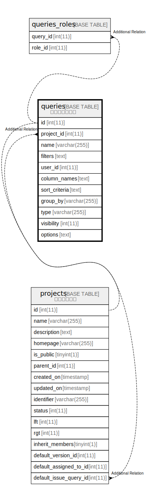

# queries

## 概要

カスタムクエリ

<details>
<summary><strong>テーブル定義</strong></summary>

```sql
CREATE TABLE `queries` (
  `id` int(11) NOT NULL AUTO_INCREMENT,
  `project_id` int(11) DEFAULT NULL,
  `name` varchar(255) NOT NULL DEFAULT '',
  `filters` text DEFAULT NULL,
  `user_id` int(11) NOT NULL DEFAULT 0,
  `column_names` text DEFAULT NULL,
  `sort_criteria` text DEFAULT NULL,
  `group_by` varchar(255) DEFAULT NULL,
  `type` varchar(255) DEFAULT NULL,
  `visibility` int(11) DEFAULT 0,
  `options` text DEFAULT NULL,
  PRIMARY KEY (`id`),
  KEY `index_queries_on_project_id` (`project_id`),
  KEY `index_queries_on_user_id` (`user_id`)
) ENGINE=InnoDB AUTO_INCREMENT=[Redacted by tbls] DEFAULT CHARSET=utf8mb4
```

</details>

## カラム一覧

| 名前            | タイプ          | デフォルト値       | NULL許可   | Extra Definition | 子テーブル                                                     | 親テーブル                   | コメント     |
| ------------- | ------------ | ------------ | -------- | ---------------- | --------------------------------------------------------- | ----------------------- | -------- |
| id            | int(11)      |              | false    | auto_increment   | [projects](projects.md) [queries_roles](queries_roles.md) |                         |          |
| project_id    | int(11)      | NULL         | true     |                  |                                                           | [projects](projects.md) |          |
| name          | varchar(255) | ''           | false    |                  |                                                           |                         |          |
| filters       | text         | NULL         | true     |                  |                                                           |                         |          |
| user_id       | int(11)      | 0            | false    |                  |                                                           |                         |          |
| column_names  | text         | NULL         | true     |                  |                                                           |                         |          |
| sort_criteria | text         | NULL         | true     |                  |                                                           |                         |          |
| group_by      | varchar(255) | NULL         | true     |                  |                                                           |                         |          |
| type          | varchar(255) | NULL         | true     |                  |                                                           |                         |          |
| visibility    | int(11)      | 0            | true     |                  |                                                           |                         |          |
| options       | text         | NULL         | true     |                  |                                                           |                         |          |

## 制約一覧

| 名前      | タイプ         | 定義               |
| ------- | ----------- | ---------------- |
| PRIMARY | PRIMARY KEY | PRIMARY KEY (id) |

## INDEX一覧

| 名前                          | 定義                                                       |
| --------------------------- | -------------------------------------------------------- |
| index_queries_on_project_id | KEY index_queries_on_project_id (project_id) USING BTREE |
| index_queries_on_user_id    | KEY index_queries_on_user_id (user_id) USING BTREE       |
| PRIMARY                     | PRIMARY KEY (id) USING BTREE                             |

## ER図



---

> Generated by [tbls](https://github.com/k1LoW/tbls)
