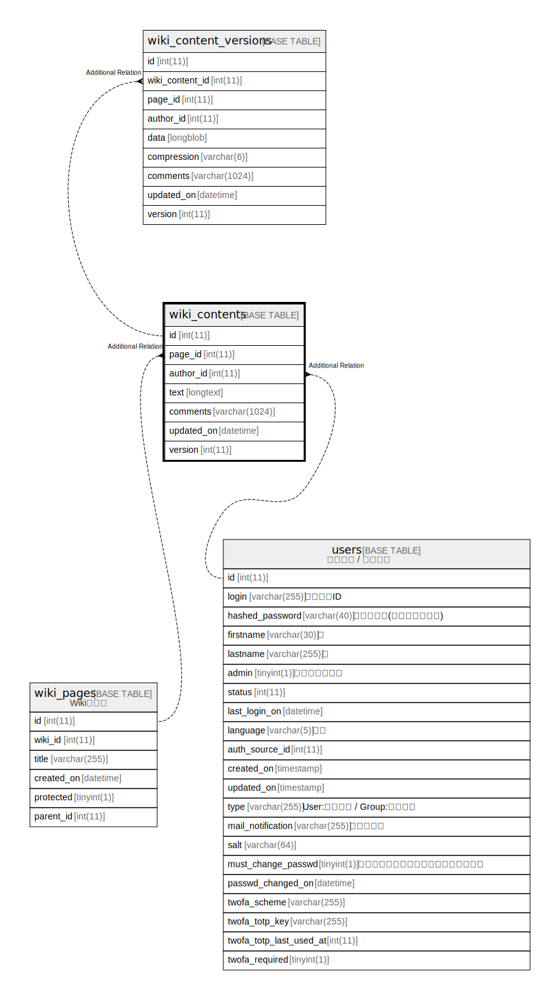

# wiki_contents

## 概要

<details>
<summary><strong>テーブル定義</strong></summary>

```sql
CREATE TABLE `wiki_contents` (
  `id` int(11) NOT NULL AUTO_INCREMENT,
  `page_id` int(11) NOT NULL,
  `author_id` int(11) DEFAULT NULL,
  `text` longtext DEFAULT NULL,
  `comments` varchar(1024) DEFAULT '',
  `updated_on` datetime NOT NULL,
  `version` int(11) NOT NULL,
  PRIMARY KEY (`id`),
  KEY `wiki_contents_page_id` (`page_id`),
  KEY `index_wiki_contents_on_author_id` (`author_id`)
) ENGINE=InnoDB AUTO_INCREMENT=[Redacted by tbls] DEFAULT CHARSET=utf8mb4
```

</details>

## カラム一覧

| 名前         | タイプ           | デフォルト値       | NULL許可   | Extra Definition | 子テーブル                                             | 親テーブル                       | コメント     |
| ---------- | ------------- | ------------ | -------- | ---------------- | ------------------------------------------------- | --------------------------- | -------- |
| id         | int(11)       |              | false    | auto_increment   | [wiki_content_versions](wiki_content_versions.md) |                             |          |
| page_id    | int(11)       |              | false    |                  |                                                   | [wiki_pages](wiki_pages.md) |          |
| author_id  | int(11)       | NULL         | true     |                  |                                                   | [users](users.md)           |          |
| text       | longtext      | NULL         | true     |                  |                                                   |                             |          |
| comments   | varchar(1024) | ''           | true     |                  |                                                   |                             |          |
| updated_on | datetime      |              | false    |                  |                                                   |                             |          |
| version    | int(11)       |              | false    |                  |                                                   |                             |          |

## 制約一覧

| 名前      | タイプ         | 定義               |
| ------- | ----------- | ---------------- |
| PRIMARY | PRIMARY KEY | PRIMARY KEY (id) |

## INDEX一覧

| 名前                               | 定義                                                           |
| -------------------------------- | ------------------------------------------------------------ |
| index_wiki_contents_on_author_id | KEY index_wiki_contents_on_author_id (author_id) USING BTREE |
| wiki_contents_page_id            | KEY wiki_contents_page_id (page_id) USING BTREE              |
| PRIMARY                          | PRIMARY KEY (id) USING BTREE                                 |

## ER図



---

> Generated by [tbls](https://github.com/k1LoW/tbls)
