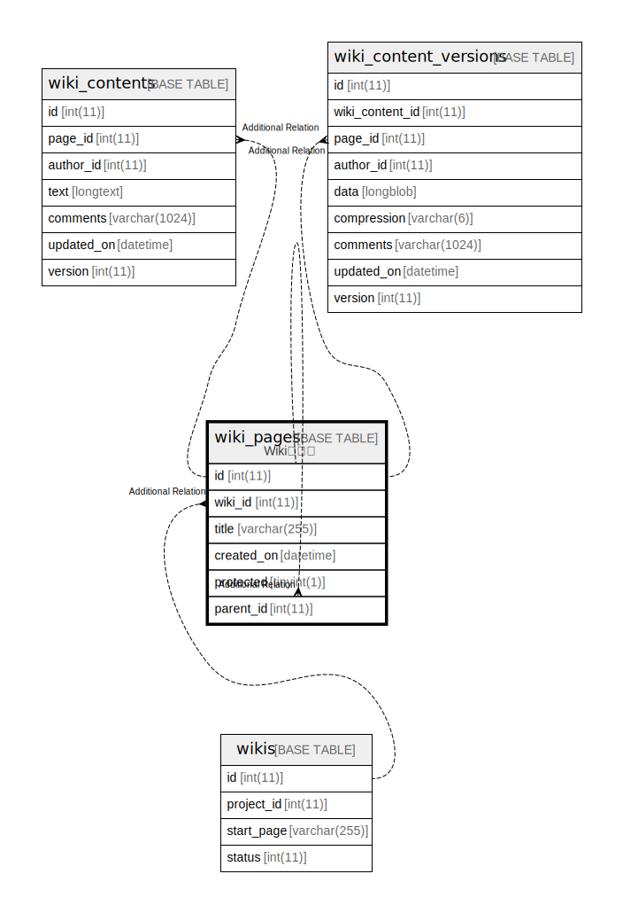

# wiki_pages

## 概要

Wikiページ

<details>
<summary><strong>テーブル定義</strong></summary>

```sql
CREATE TABLE `wiki_pages` (
  `id` int(11) NOT NULL AUTO_INCREMENT,
  `wiki_id` int(11) NOT NULL,
  `title` varchar(255) NOT NULL,
  `created_on` datetime NOT NULL,
  `protected` tinyint(1) NOT NULL DEFAULT 0,
  `parent_id` int(11) DEFAULT NULL,
  PRIMARY KEY (`id`),
  KEY `wiki_pages_wiki_id_title` (`wiki_id`,`title`),
  KEY `index_wiki_pages_on_wiki_id` (`wiki_id`),
  KEY `index_wiki_pages_on_parent_id` (`parent_id`)
) ENGINE=InnoDB AUTO_INCREMENT=[Redacted by tbls] DEFAULT CHARSET=utf8mb4
```

</details>

## カラム一覧

| 名前         | タイプ          | デフォルト値       | NULL許可   | Extra Definition | 子テーブル                                                                                                           | 親テーブル                       | コメント     |
| ---------- | ------------ | ------------ | -------- | ---------------- | --------------------------------------------------------------------------------------------------------------- | --------------------------- | -------- |
| id         | int(11)      |              | false    | auto_increment   | [wiki_pages](wiki_pages.md) [wiki_contents](wiki_contents.md) [wiki_content_versions](wiki_content_versions.md) |                             |          |
| wiki_id    | int(11)      |              | false    |                  |                                                                                                                 | [wikis](wikis.md)           |          |
| title      | varchar(255) |              | false    |                  |                                                                                                                 |                             |          |
| created_on | datetime     |              | false    |                  |                                                                                                                 |                             |          |
| protected  | tinyint(1)   | 0            | false    |                  |                                                                                                                 |                             |          |
| parent_id  | int(11)      | NULL         | true     |                  |                                                                                                                 | [wiki_pages](wiki_pages.md) |          |

## 制約一覧

| 名前      | タイプ         | 定義               |
| ------- | ----------- | ---------------- |
| PRIMARY | PRIMARY KEY | PRIMARY KEY (id) |

## INDEX一覧

| 名前                            | 定義                                                        |
| ----------------------------- | --------------------------------------------------------- |
| index_wiki_pages_on_parent_id | KEY index_wiki_pages_on_parent_id (parent_id) USING BTREE |
| index_wiki_pages_on_wiki_id   | KEY index_wiki_pages_on_wiki_id (wiki_id) USING BTREE     |
| wiki_pages_wiki_id_title      | KEY wiki_pages_wiki_id_title (wiki_id, title) USING BTREE |
| PRIMARY                       | PRIMARY KEY (id) USING BTREE                              |

## ER図



---

> Generated by [tbls](https://github.com/k1LoW/tbls)
