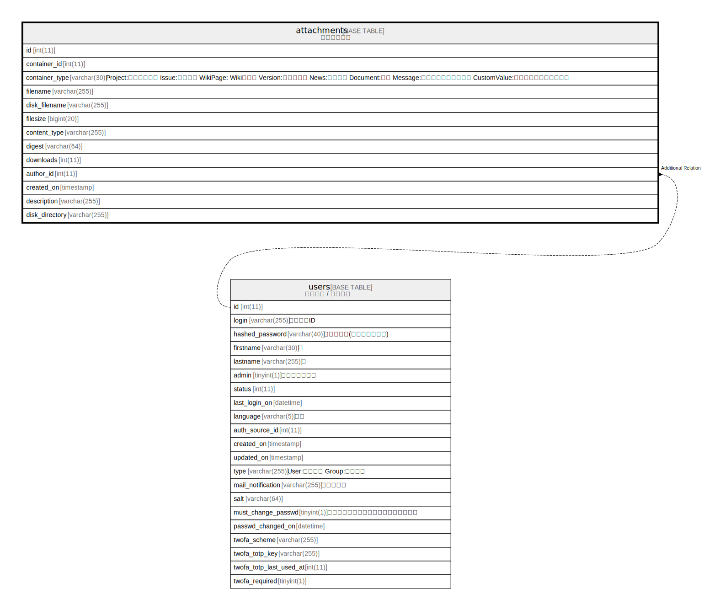

# attachments

## 概要

<details>
<summary><strong>テーブル定義</strong></summary>

```sql
CREATE TABLE `attachments` (
  `id` int(11) NOT NULL AUTO_INCREMENT,
  `container_id` int(11) DEFAULT NULL,
  `container_type` varchar(30) DEFAULT NULL,
  `filename` varchar(255) NOT NULL DEFAULT '',
  `disk_filename` varchar(255) NOT NULL DEFAULT '',
  `filesize` bigint(20) NOT NULL DEFAULT 0,
  `content_type` varchar(255) DEFAULT '',
  `digest` varchar(64) NOT NULL DEFAULT '',
  `downloads` int(11) NOT NULL DEFAULT 0,
  `author_id` int(11) NOT NULL DEFAULT 0,
  `created_on` timestamp NULL DEFAULT NULL,
  `description` varchar(255) DEFAULT NULL,
  `disk_directory` varchar(255) DEFAULT NULL,
  PRIMARY KEY (`id`),
  KEY `index_attachments_on_author_id` (`author_id`),
  KEY `index_attachments_on_created_on` (`created_on`),
  KEY `index_attachments_on_container_id_and_container_type` (`container_id`,`container_type`),
  KEY `index_attachments_on_disk_filename` (`disk_filename`)
) ENGINE=InnoDB DEFAULT CHARSET=utf8mb4
```

</details>

## カラム一覧

| 名前             | タイプ          | デフォルト値       | NULL許可   | Extra Definition | 子テーブル      | 親テーブル             | コメント     |
| -------------- | ------------ | ------------ | -------- | ---------------- | ---------- | ----------------- | -------- |
| id             | int(11)      |              | false    | auto_increment   |            |                   |          |
| container_id   | int(11)      | NULL         | true     |                  |            |                   |          |
| container_type | varchar(30)  | NULL         | true     |                  |            |                   |          |
| filename       | varchar(255) | ''           | false    |                  |            |                   |          |
| disk_filename  | varchar(255) | ''           | false    |                  |            |                   |          |
| filesize       | bigint(20)   | 0            | false    |                  |            |                   |          |
| content_type   | varchar(255) | ''           | true     |                  |            |                   |          |
| digest         | varchar(64)  | ''           | false    |                  |            |                   |          |
| downloads      | int(11)      | 0            | false    |                  |            |                   |          |
| author_id      | int(11)      | 0            | false    |                  |            | [users](users.md) |          |
| created_on     | timestamp    | NULL         | true     |                  |            |                   |          |
| description    | varchar(255) | NULL         | true     |                  |            |                   |          |
| disk_directory | varchar(255) | NULL         | true     |                  |            |                   |          |

## 制約一覧

| 名前      | タイプ         | 定義               |
| ------- | ----------- | ---------------- |
| PRIMARY | PRIMARY KEY | PRIMARY KEY (id) |

## INDEX一覧

| 名前                                                   | 定義                                                                                                  |
| ---------------------------------------------------- | --------------------------------------------------------------------------------------------------- |
| index_attachments_on_author_id                       | KEY index_attachments_on_author_id (author_id) USING BTREE                                          |
| index_attachments_on_container_id_and_container_type | KEY index_attachments_on_container_id_and_container_type (container_id, container_type) USING BTREE |
| index_attachments_on_created_on                      | KEY index_attachments_on_created_on (created_on) USING BTREE                                        |
| index_attachments_on_disk_filename                   | KEY index_attachments_on_disk_filename (disk_filename) USING BTREE                                  |
| PRIMARY                                              | PRIMARY KEY (id) USING BTREE                                                                        |

## ER図



---

> Generated by [tbls](https://github.com/k1LoW/tbls)
