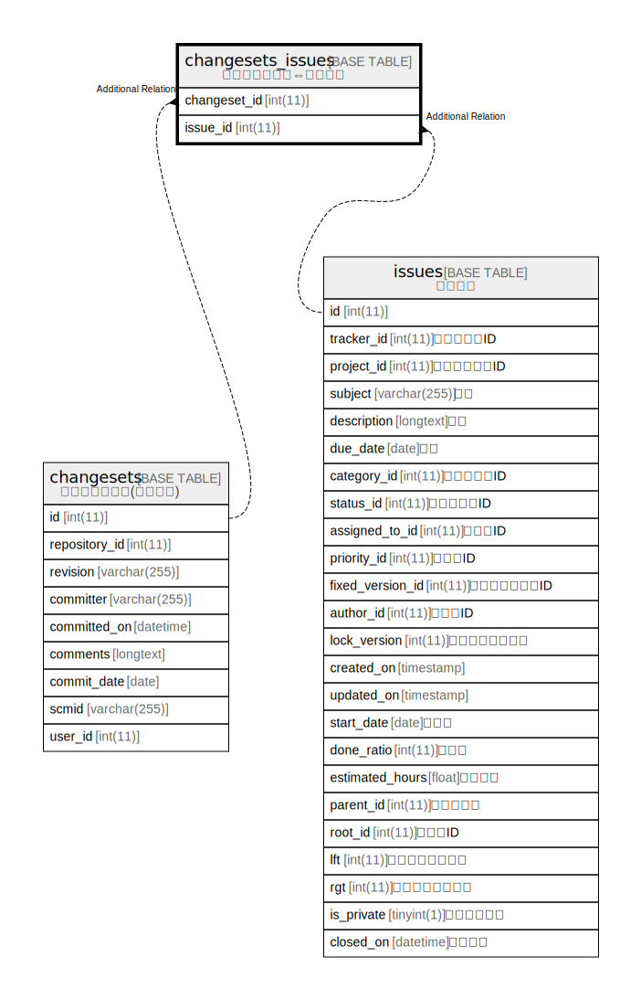

# changesets_issues

## 概要

チェンジセット⇔チケット

<details>
<summary><strong>テーブル定義</strong></summary>

```sql
CREATE TABLE `changesets_issues` (
  `changeset_id` int(11) NOT NULL,
  `issue_id` int(11) NOT NULL,
  UNIQUE KEY `changesets_issues_ids` (`changeset_id`,`issue_id`),
  KEY `index_changesets_issues_on_issue_id` (`issue_id`)
) ENGINE=InnoDB DEFAULT CHARSET=utf8mb4
```

</details>

## カラム一覧

| 名前           | タイプ     | デフォルト値       | NULL許可   | 子テーブル      | 親テーブル                       | コメント     |
| ------------ | ------- | ------------ | -------- | ---------- | --------------------------- | -------- |
| changeset_id | int(11) |              | false    |            | [changesets](changesets.md) |          |
| issue_id     | int(11) |              | false    |            | [issues](issues.md)         |          |

## 制約一覧

| 名前                    | タイプ    | 定義                                                        |
| --------------------- | ------ | --------------------------------------------------------- |
| changesets_issues_ids | UNIQUE | UNIQUE KEY changesets_issues_ids (changeset_id, issue_id) |

## INDEX一覧

| 名前                                  | 定義                                                                    |
| ----------------------------------- | --------------------------------------------------------------------- |
| index_changesets_issues_on_issue_id | KEY index_changesets_issues_on_issue_id (issue_id) USING BTREE        |
| changesets_issues_ids               | UNIQUE KEY changesets_issues_ids (changeset_id, issue_id) USING BTREE |

## ER図



---

> Generated by [tbls](https://github.com/k1LoW/tbls)
