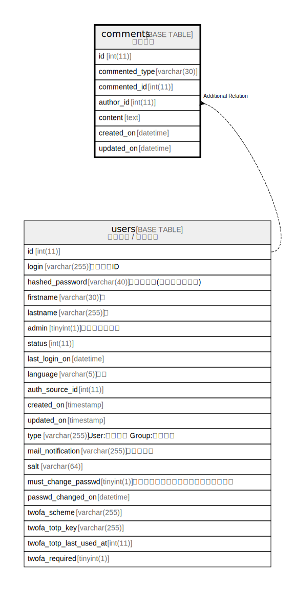

# comments

## 概要

コメント

<details>
<summary><strong>テーブル定義</strong></summary>

```sql
CREATE TABLE `comments` (
  `id` int(11) NOT NULL AUTO_INCREMENT,
  `commented_type` varchar(30) NOT NULL DEFAULT '',
  `commented_id` int(11) NOT NULL DEFAULT 0,
  `author_id` int(11) NOT NULL DEFAULT 0,
  `content` text DEFAULT NULL,
  `created_on` datetime NOT NULL,
  `updated_on` datetime NOT NULL,
  PRIMARY KEY (`id`),
  KEY `index_comments_on_commented_id_and_commented_type` (`commented_id`,`commented_type`),
  KEY `index_comments_on_author_id` (`author_id`)
) ENGINE=InnoDB DEFAULT CHARSET=utf8mb4 COLLATE=utf8mb4_general_ci
```

</details>

## ラベル

`ポリモーフィック関連`

## カラム一覧

| 名前             | タイプ         | デフォルト値       | NULL許可   | Extra Definition | 子テーブル      | 親テーブル             | コメント     |
| -------------- | ----------- | ------------ | -------- | ---------------- | ---------- | ----------------- | -------- |
| id             | int(11)     |              | false    | auto_increment   |            |                   |          |
| commented_type | varchar(30) | ''           | false    |                  |            |                   |          |
| commented_id   | int(11)     | 0            | false    |                  |            |                   |          |
| author_id      | int(11)     | 0            | false    |                  |            | [users](users.md) |          |
| content        | text        | NULL         | true     |                  |            |                   |          |
| created_on     | datetime    |              | false    |                  |            |                   |          |
| updated_on     | datetime    |              | false    |                  |            |                   |          |

## 制約一覧

| 名前      | タイプ         | 定義               |
| ------- | ----------- | ---------------- |
| PRIMARY | PRIMARY KEY | PRIMARY KEY (id) |

## INDEX一覧

| 名前                                                | 定義                                                                                               |
| ------------------------------------------------- | ------------------------------------------------------------------------------------------------ |
| index_comments_on_author_id                       | KEY index_comments_on_author_id (author_id) USING BTREE                                          |
| index_comments_on_commented_id_and_commented_type | KEY index_comments_on_commented_id_and_commented_type (commented_id, commented_type) USING BTREE |
| PRIMARY                                           | PRIMARY KEY (id) USING BTREE                                                                     |

## ER図



---

> Generated by [tbls](https://github.com/k1LoW/tbls)
