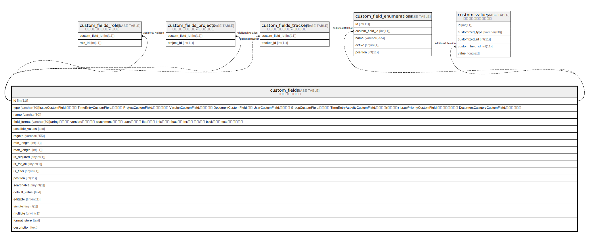

# custom_fields

## 概要

カスタムフィールド

<details>
<summary><strong>テーブル定義</strong></summary>

```sql
CREATE TABLE `custom_fields` (
  `id` int(11) NOT NULL AUTO_INCREMENT,
  `type` varchar(30) NOT NULL DEFAULT '',
  `name` varchar(30) NOT NULL DEFAULT '',
  `field_format` varchar(30) NOT NULL DEFAULT '',
  `possible_values` text DEFAULT NULL,
  `regexp` varchar(255) DEFAULT '',
  `min_length` int(11) DEFAULT NULL,
  `max_length` int(11) DEFAULT NULL,
  `is_required` tinyint(1) NOT NULL DEFAULT 0,
  `is_for_all` tinyint(1) NOT NULL DEFAULT 0,
  `is_filter` tinyint(1) NOT NULL DEFAULT 0,
  `position` int(11) DEFAULT NULL,
  `searchable` tinyint(1) DEFAULT 0,
  `default_value` text DEFAULT NULL,
  `editable` tinyint(1) DEFAULT 1,
  `visible` tinyint(1) NOT NULL DEFAULT 1,
  `multiple` tinyint(1) DEFAULT 0,
  `format_store` text DEFAULT NULL,
  `description` text DEFAULT NULL,
  PRIMARY KEY (`id`),
  KEY `index_custom_fields_on_id_and_type` (`id`,`type`)
) ENGINE=InnoDB DEFAULT CHARSET=utf8mb4 COLLATE=utf8mb4_general_ci
```

</details>

## ラベル

`単一テーブル継承`

## カラム一覧

| 名前              | タイプ          | デフォルト値       | NULL許可   | Extra Definition | 子テーブル                                                                                                                                                                                                                                             | 親テーブル      | コメント                                                                                                                                                                                                                                                                                                                                                                |
| --------------- | ------------ | ------------ | -------- | ---------------- | ------------------------------------------------------------------------------------------------------------------------------------------------------------------------------------------------------------------------------------------------- | ---------- | ------------------------------------------------------------------------------------------------------------------------------------------------------------------------------------------------------------------------------------------------------------------------------------------------------------------------------------------------------------------- |
| id              | int(11)      |              | false    | auto_increment   | [custom_fields_roles](custom_fields_roles.md) [custom_fields_projects](custom_fields_projects.md) [custom_fields_trackers](custom_fields_trackers.md) [custom_field_enumerations](custom_field_enumerations.md) [custom_values](custom_values.md) |            |                                                                                                                                                                                                                                                                                                                                                                     |
| type            | varchar(30)  | ''           | false    |                  |                                                                                                                                                                                                                                                   |            | IssueCustomField:チケット<br>TimeEntryCustomField:作業時間<br>ProjectCustomField:プロジェクト<br>VersionCustomField:バージョン<br>DocumentCustomField:文書<br>UserCustomField:ユーザー<br>GroupCustomField:グループ<br>TimeEntryActivityCustomField:作業分類(時間管理)<br>IssuePriorityCustomField:チケットの優先度<br>DocumentCategoryCustomField:文書カテゴリ<br>                                                    |
| name            | varchar(30)  | ''           | false    |                  |                                                                                                                                                                                                                                                   |            |                                                                                                                                                                                                                                                                                                                                                                     |
| field_format    | varchar(30)  | ''           | false    |                  |                                                                                                                                                                                                                                                   |            | string:テキスト<br>version:バージョン<br>attachment:ファイル<br>user:ユーザー<br>list:リスト<br>link:リンク<br>float:小数<br>int:整数<br>整数:日付<br>bool:真偽値<br>text:長いテキスト<br>                                                                                                                                                                                                                  |
| possible_values | text         | NULL         | true     |                  |                                                                                                                                                                                                                                                   |            |                                                                                                                                                                                                                                                                                                                                                                     |
| regexp          | varchar(255) | ''           | true     |                  |                                                                                                                                                                                                                                                   |            |                                                                                                                                                                                                                                                                                                                                                                     |
| min_length      | int(11)      | NULL         | true     |                  |                                                                                                                                                                                                                                                   |            |                                                                                                                                                                                                                                                                                                                                                                     |
| max_length      | int(11)      | NULL         | true     |                  |                                                                                                                                                                                                                                                   |            |                                                                                                                                                                                                                                                                                                                                                                     |
| is_required     | tinyint(1)   | 0            | false    |                  |                                                                                                                                                                                                                                                   |            |                                                                                                                                                                                                                                                                                                                                                                     |
| is_for_all      | tinyint(1)   | 0            | false    |                  |                                                                                                                                                                                                                                                   |            |                                                                                                                                                                                                                                                                                                                                                                     |
| is_filter       | tinyint(1)   | 0            | false    |                  |                                                                                                                                                                                                                                                   |            |                                                                                                                                                                                                                                                                                                                                                                     |
| position        | int(11)      | NULL         | true     |                  |                                                                                                                                                                                                                                                   |            |                                                                                                                                                                                                                                                                                                                                                                     |
| searchable      | tinyint(1)   | 0            | true     |                  |                                                                                                                                                                                                                                                   |            |                                                                                                                                                                                                                                                                                                                                                                     |
| default_value   | text         | NULL         | true     |                  |                                                                                                                                                                                                                                                   |            |                                                                                                                                                                                                                                                                                                                                                                     |
| editable        | tinyint(1)   | 1            | true     |                  |                                                                                                                                                                                                                                                   |            |                                                                                                                                                                                                                                                                                                                                                                     |
| visible         | tinyint(1)   | 1            | false    |                  |                                                                                                                                                                                                                                                   |            |                                                                                                                                                                                                                                                                                                                                                                     |
| multiple        | tinyint(1)   | 0            | true     |                  |                                                                                                                                                                                                                                                   |            |                                                                                                                                                                                                                                                                                                                                                                     |
| format_store    | text         | NULL         | true     |                  |                                                                                                                                                                                                                                                   |            |                                                                                                                                                                                                                                                                                                                                                                     |
| description     | text         | NULL         | true     |                  |                                                                                                                                                                                                                                                   |            |                                                                                                                                                                                                                                                                                                                                                                     |

## 制約一覧

| 名前      | タイプ         | 定義               |
| ------- | ----------- | ---------------- |
| PRIMARY | PRIMARY KEY | PRIMARY KEY (id) |

## INDEX一覧

| 名前                                 | 定義                                                            |
| ---------------------------------- | ------------------------------------------------------------- |
| index_custom_fields_on_id_and_type | KEY index_custom_fields_on_id_and_type (id, type) USING BTREE |
| PRIMARY                            | PRIMARY KEY (id) USING BTREE                                  |

## ER図



---

> Generated by [tbls](https://github.com/k1LoW/tbls)
