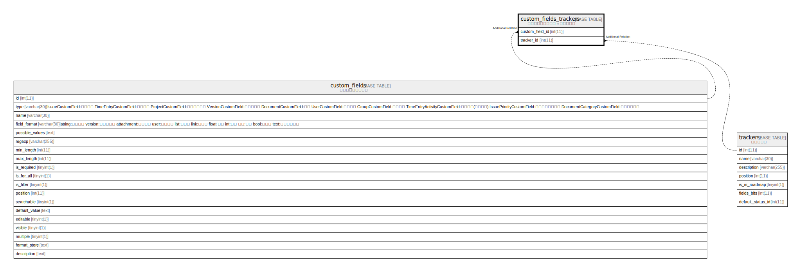

# custom_fields_trackers

## 概要

カスタムフィールド⇔トラッカー

<details>
<summary><strong>テーブル定義</strong></summary>

```sql
CREATE TABLE `custom_fields_trackers` (
  `custom_field_id` int(11) NOT NULL DEFAULT 0,
  `tracker_id` int(11) NOT NULL DEFAULT 0,
  UNIQUE KEY `index_custom_fields_trackers_on_custom_field_id_and_tracker_id` (`custom_field_id`,`tracker_id`)
) ENGINE=InnoDB DEFAULT CHARSET=utf8mb4
```

</details>

## カラム一覧

| 名前              | タイプ     | デフォルト値       | NULL許可   | 子テーブル      | 親テーブル                             | コメント     |
| --------------- | ------- | ------------ | -------- | ---------- | --------------------------------- | -------- |
| custom_field_id | int(11) | 0            | false    |            | [custom_fields](custom_fields.md) |          |
| tracker_id      | int(11) | 0            | false    |            | [trackers](trackers.md)           |          |

## 制約一覧

| 名前                                                             | タイプ    | 定義                                                                                                      |
| -------------------------------------------------------------- | ------ | ------------------------------------------------------------------------------------------------------- |
| index_custom_fields_trackers_on_custom_field_id_and_tracker_id | UNIQUE | UNIQUE KEY index_custom_fields_trackers_on_custom_field_id_and_tracker_id (custom_field_id, tracker_id) |

## INDEX一覧

| 名前                                                             | 定義                                                                                                                  |
| -------------------------------------------------------------- | ------------------------------------------------------------------------------------------------------------------- |
| index_custom_fields_trackers_on_custom_field_id_and_tracker_id | UNIQUE KEY index_custom_fields_trackers_on_custom_field_id_and_tracker_id (custom_field_id, tracker_id) USING BTREE |

## ER図



---

> Generated by [tbls](https://github.com/k1LoW/tbls)
