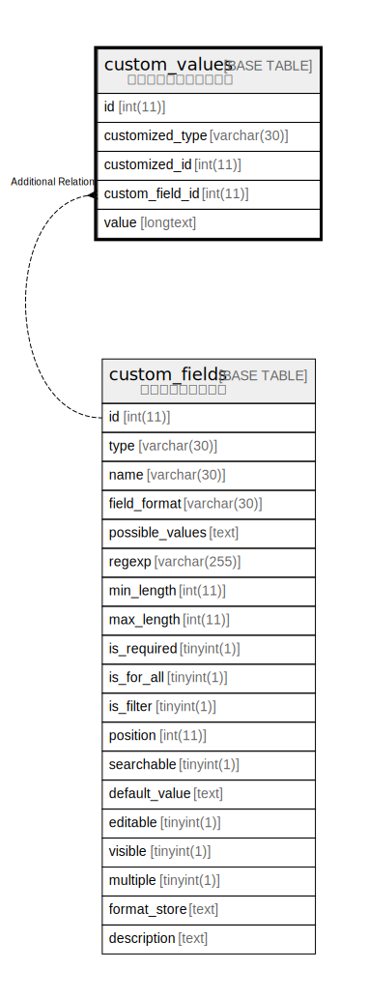

# custom_values

## 概要

カスタムフィールドの値

<details>
<summary><strong>テーブル定義</strong></summary>

```sql
CREATE TABLE `custom_values` (
  `id` int(11) NOT NULL AUTO_INCREMENT,
  `customized_type` varchar(30) NOT NULL DEFAULT '',
  `customized_id` int(11) NOT NULL DEFAULT 0,
  `custom_field_id` int(11) NOT NULL DEFAULT 0,
  `value` longtext DEFAULT NULL,
  PRIMARY KEY (`id`),
  KEY `custom_values_customized` (`customized_type`,`customized_id`),
  KEY `index_custom_values_on_custom_field_id` (`custom_field_id`)
) ENGINE=InnoDB DEFAULT CHARSET=utf8mb4
```

</details>

## カラム一覧

| 名前              | タイプ         | デフォルト値       | NULL許可   | Extra Definition | 子テーブル      | 親テーブル                             | コメント     |
| --------------- | ----------- | ------------ | -------- | ---------------- | ---------- | --------------------------------- | -------- |
| id              | int(11)     |              | false    | auto_increment   |            |                                   |          |
| customized_type | varchar(30) | ''           | false    |                  |            |                                   |          |
| customized_id   | int(11)     | 0            | false    |                  |            |                                   |          |
| custom_field_id | int(11)     | 0            | false    |                  |            | [custom_fields](custom_fields.md) |          |
| value           | longtext    | NULL         | true     |                  |            |                                   |          |

## 制約一覧

| 名前      | タイプ         | 定義               |
| ------- | ----------- | ---------------- |
| PRIMARY | PRIMARY KEY | PRIMARY KEY (id) |

## INDEX一覧

| 名前                                     | 定義                                                                        |
| -------------------------------------- | ------------------------------------------------------------------------- |
| custom_values_customized               | KEY custom_values_customized (customized_type, customized_id) USING BTREE |
| index_custom_values_on_custom_field_id | KEY index_custom_values_on_custom_field_id (custom_field_id) USING BTREE  |
| PRIMARY                                | PRIMARY KEY (id) USING BTREE                                              |

## ER図



---

> Generated by [tbls](https://github.com/k1LoW/tbls)
