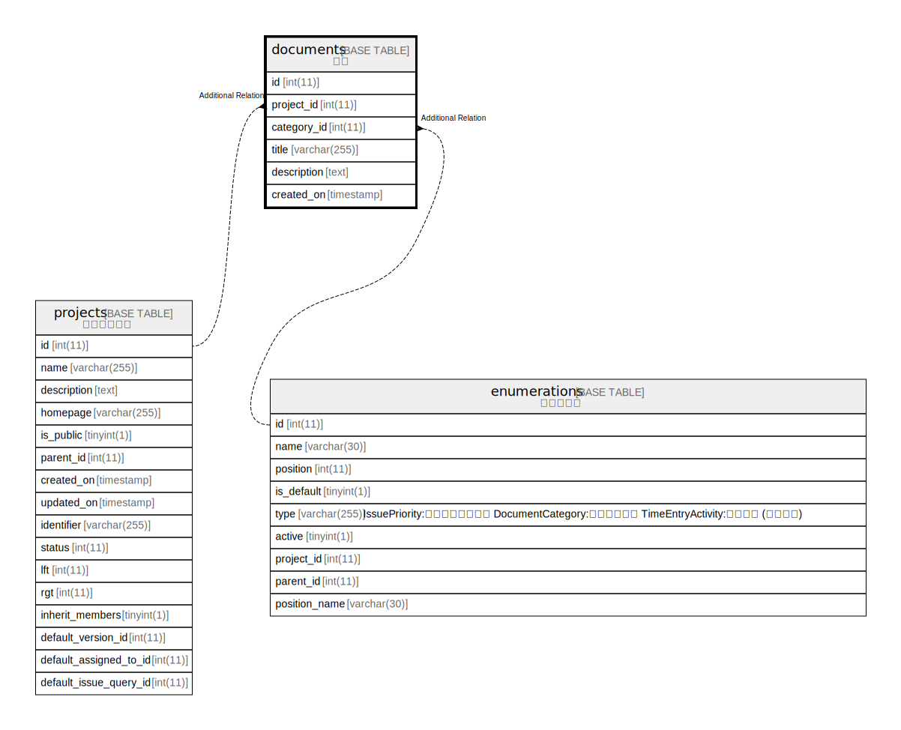

# documents

## 概要

文書

<details>
<summary><strong>テーブル定義</strong></summary>

```sql
CREATE TABLE `documents` (
  `id` int(11) NOT NULL AUTO_INCREMENT,
  `project_id` int(11) NOT NULL DEFAULT 0,
  `category_id` int(11) NOT NULL DEFAULT 0,
  `title` varchar(255) NOT NULL DEFAULT '',
  `description` text DEFAULT NULL,
  `created_on` timestamp NULL DEFAULT NULL,
  PRIMARY KEY (`id`),
  KEY `documents_project_id` (`project_id`),
  KEY `index_documents_on_category_id` (`category_id`),
  KEY `index_documents_on_created_on` (`created_on`)
) ENGINE=InnoDB DEFAULT CHARSET=utf8mb4 COLLATE=utf8mb4_general_ci
```

</details>

## カラム一覧

| 名前          | タイプ          | デフォルト値       | NULL許可   | Extra Definition | 子テーブル      | 親テーブル                           | コメント     |
| ----------- | ------------ | ------------ | -------- | ---------------- | ---------- | ------------------------------- | -------- |
| id          | int(11)      |              | false    | auto_increment   |            |                                 |          |
| project_id  | int(11)      | 0            | false    |                  |            | [projects](projects.md)         |          |
| category_id | int(11)      | 0            | false    |                  |            | [enumerations](enumerations.md) |          |
| title       | varchar(255) | ''           | false    |                  |            |                                 |          |
| description | text         | NULL         | true     |                  |            |                                 |          |
| created_on  | timestamp    | NULL         | true     |                  |            |                                 |          |

## 制約一覧

| 名前      | タイプ         | 定義               |
| ------- | ----------- | ---------------- |
| PRIMARY | PRIMARY KEY | PRIMARY KEY (id) |

## INDEX一覧

| 名前                             | 定義                                                           |
| ------------------------------ | ------------------------------------------------------------ |
| documents_project_id           | KEY documents_project_id (project_id) USING BTREE            |
| index_documents_on_category_id | KEY index_documents_on_category_id (category_id) USING BTREE |
| index_documents_on_created_on  | KEY index_documents_on_created_on (created_on) USING BTREE   |
| PRIMARY                        | PRIMARY KEY (id) USING BTREE                                 |

## ER図



---

> Generated by [tbls](https://github.com/k1LoW/tbls)
