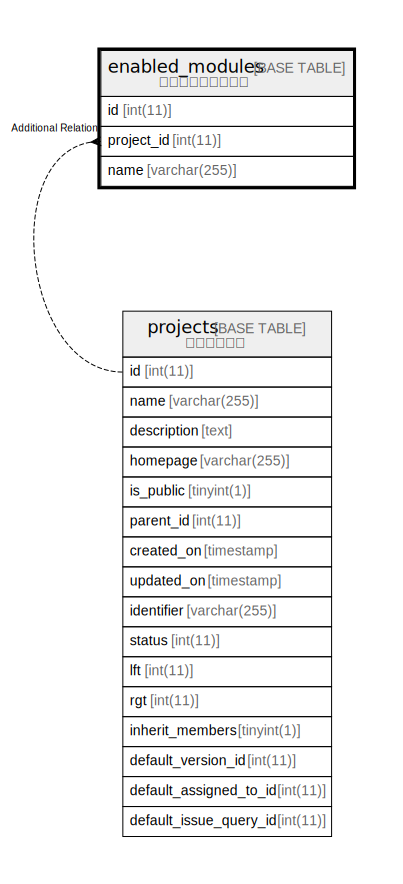

# enabled_modules

## 概要

モジュールの有効化

<details>
<summary><strong>テーブル定義</strong></summary>

```sql
CREATE TABLE `enabled_modules` (
  `id` int(11) NOT NULL AUTO_INCREMENT,
  `project_id` int(11) DEFAULT NULL,
  `name` varchar(255) NOT NULL,
  PRIMARY KEY (`id`),
  KEY `enabled_modules_project_id` (`project_id`)
) ENGINE=InnoDB DEFAULT CHARSET=utf8mb4
```

</details>

## カラム一覧

| 名前         | タイプ          | デフォルト値       | NULL許可   | Extra Definition | 子テーブル      | 親テーブル                   | コメント     |
| ---------- | ------------ | ------------ | -------- | ---------------- | ---------- | ----------------------- | -------- |
| id         | int(11)      |              | false    | auto_increment   |            |                         |          |
| project_id | int(11)      | NULL         | true     |                  |            | [projects](projects.md) |          |
| name       | varchar(255) |              | false    |                  |            |                         |          |

## 制約一覧

| 名前      | タイプ         | 定義               |
| ------- | ----------- | ---------------- |
| PRIMARY | PRIMARY KEY | PRIMARY KEY (id) |

## INDEX一覧

| 名前                         | 定義                                                      |
| -------------------------- | ------------------------------------------------------- |
| enabled_modules_project_id | KEY enabled_modules_project_id (project_id) USING BTREE |
| PRIMARY                    | PRIMARY KEY (id) USING BTREE                            |

## ER図



---

> Generated by [tbls](https://github.com/k1LoW/tbls)
