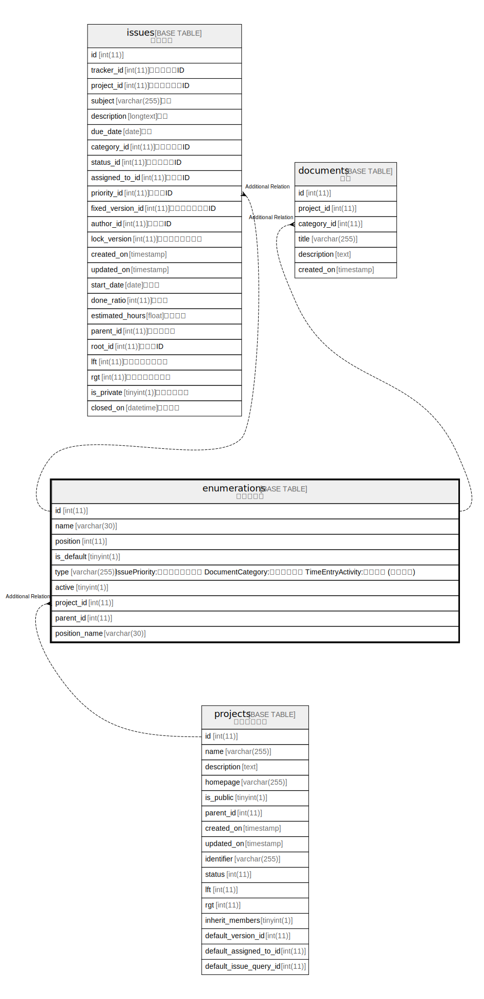

# enumerations

## 概要

選択肢の値

<details>
<summary><strong>テーブル定義</strong></summary>

```sql
CREATE TABLE `enumerations` (
  `id` int(11) NOT NULL AUTO_INCREMENT,
  `name` varchar(30) NOT NULL DEFAULT '',
  `position` int(11) DEFAULT NULL,
  `is_default` tinyint(1) NOT NULL DEFAULT 0,
  `type` varchar(255) DEFAULT NULL,
  `active` tinyint(1) NOT NULL DEFAULT 1,
  `project_id` int(11) DEFAULT NULL,
  `parent_id` int(11) DEFAULT NULL,
  `position_name` varchar(30) DEFAULT NULL,
  PRIMARY KEY (`id`),
  KEY `index_enumerations_on_project_id` (`project_id`),
  KEY `index_enumerations_on_id_and_type` (`id`,`type`)
) ENGINE=InnoDB DEFAULT CHARSET=utf8mb4
```

</details>

## ラベル

`単一テーブル継承`

## カラム一覧

| 名前            | タイプ          | デフォルト値       | NULL許可   | Extra Definition | 子テーブル                                         | 親テーブル                   | コメント                                                                                                         |
| ------------- | ------------ | ------------ | -------- | ---------------- | --------------------------------------------- | ----------------------- | ------------------------------------------------------------------------------------------------------------ |
| id            | int(11)      |              | false    | auto_increment   | [issues](issues.md) [documents](documents.md) |                         |                                                                                                              |
| name          | varchar(30)  | ''           | false    |                  |                                               |                         |                                                                                                              |
| position      | int(11)      | NULL         | true     |                  |                                               |                         |                                                                                                              |
| is_default    | tinyint(1)   | 0            | false    |                  |                                               |                         |                                                                                                              |
| type          | varchar(255) | NULL         | true     |                  |                                               |                         | IssuePriority:チケットの優先度<br>DocumentCategory:文書カテゴリ<br>TimeEntryActivity:作業分類 (時間管理)<br>                       |
| active        | tinyint(1)   | 1            | false    |                  |                                               |                         |                                                                                                              |
| project_id    | int(11)      | NULL         | true     |                  |                                               | [projects](projects.md) |                                                                                                              |
| parent_id     | int(11)      | NULL         | true     |                  |                                               |                         |                                                                                                              |
| position_name | varchar(30)  | NULL         | true     |                  |                                               |                         |                                                                                                              |

## 制約一覧

| 名前      | タイプ         | 定義               |
| ------- | ----------- | ---------------- |
| PRIMARY | PRIMARY KEY | PRIMARY KEY (id) |

## INDEX一覧

| 名前                                | 定義                                                            |
| --------------------------------- | ------------------------------------------------------------- |
| index_enumerations_on_id_and_type | KEY index_enumerations_on_id_and_type (id, type) USING BTREE  |
| index_enumerations_on_project_id  | KEY index_enumerations_on_project_id (project_id) USING BTREE |
| PRIMARY                           | PRIMARY KEY (id) USING BTREE                                  |

## ER図



---

> Generated by [tbls](https://github.com/k1LoW/tbls)
