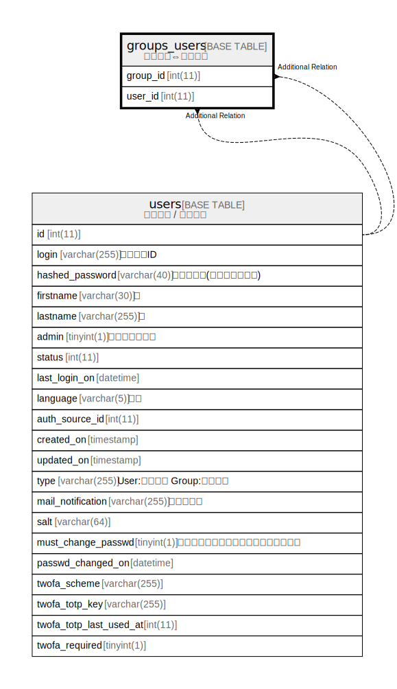

# groups_users

## 概要

グループ⇔ユーザー

<details>
<summary><strong>テーブル定義</strong></summary>

```sql
CREATE TABLE `groups_users` (
  `group_id` int(11) NOT NULL,
  `user_id` int(11) NOT NULL,
  UNIQUE KEY `groups_users_ids` (`group_id`,`user_id`)
) ENGINE=InnoDB DEFAULT CHARSET=utf8mb4
```

</details>

## カラム一覧

| 名前       | タイプ     | デフォルト値       | NULL許可   | 子テーブル      | 親テーブル             | コメント     |
| -------- | ------- | ------------ | -------- | ---------- | ----------------- | -------- |
| group_id | int(11) |              | false    |            | [users](users.md) |          |
| user_id  | int(11) |              | false    |            | [users](users.md) |          |

## 制約一覧

| 名前               | タイプ    | 定義                                              |
| ---------------- | ------ | ----------------------------------------------- |
| groups_users_ids | UNIQUE | UNIQUE KEY groups_users_ids (group_id, user_id) |

## INDEX一覧

| 名前               | 定義                                                          |
| ---------------- | ----------------------------------------------------------- |
| groups_users_ids | UNIQUE KEY groups_users_ids (group_id, user_id) USING BTREE |

## ER図



---

> Generated by [tbls](https://github.com/k1LoW/tbls)
