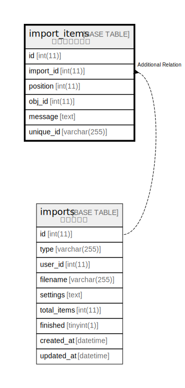

# import_items

## 概要

インポート項目

<details>
<summary><strong>テーブル定義</strong></summary>

```sql
CREATE TABLE `import_items` (
  `id` int(11) NOT NULL AUTO_INCREMENT,
  `import_id` int(11) NOT NULL,
  `position` int(11) NOT NULL,
  `obj_id` int(11) DEFAULT NULL,
  `message` text DEFAULT NULL,
  `unique_id` varchar(255) DEFAULT NULL,
  PRIMARY KEY (`id`),
  KEY `index_import_items_on_import_id_and_unique_id` (`import_id`,`unique_id`)
) ENGINE=InnoDB DEFAULT CHARSET=utf8mb4 COLLATE=utf8mb4_general_ci
```

</details>

## カラム一覧

| 名前        | タイプ          | デフォルト値       | NULL許可   | Extra Definition | 子テーブル      | 親テーブル                 | コメント     |
| --------- | ------------ | ------------ | -------- | ---------------- | ---------- | --------------------- | -------- |
| id        | int(11)      |              | false    | auto_increment   |            |                       |          |
| import_id | int(11)      |              | false    |                  |            | [imports](imports.md) |          |
| position  | int(11)      |              | false    |                  |            |                       |          |
| obj_id    | int(11)      | NULL         | true     |                  |            |                       |          |
| message   | text         | NULL         | true     |                  |            |                       |          |
| unique_id | varchar(255) | NULL         | true     |                  |            |                       |          |

## 制約一覧

| 名前      | タイプ         | 定義               |
| ------- | ----------- | ---------------- |
| PRIMARY | PRIMARY KEY | PRIMARY KEY (id) |

## INDEX一覧

| 名前                                            | 定義                                                                                   |
| --------------------------------------------- | ------------------------------------------------------------------------------------ |
| index_import_items_on_import_id_and_unique_id | KEY index_import_items_on_import_id_and_unique_id (import_id, unique_id) USING BTREE |
| PRIMARY                                       | PRIMARY KEY (id) USING BTREE                                                         |

## ER図



---

> Generated by [tbls](https://github.com/k1LoW/tbls)
