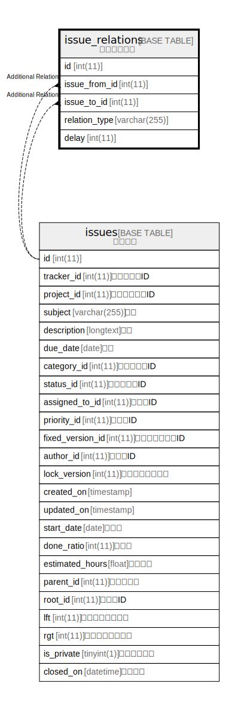

# issue_relations

## 概要

関連チケット

<details>
<summary><strong>テーブル定義</strong></summary>

```sql
CREATE TABLE `issue_relations` (
  `id` int(11) NOT NULL AUTO_INCREMENT,
  `issue_from_id` int(11) NOT NULL,
  `issue_to_id` int(11) NOT NULL,
  `relation_type` varchar(255) NOT NULL DEFAULT '',
  `delay` int(11) DEFAULT NULL,
  PRIMARY KEY (`id`),
  UNIQUE KEY `index_issue_relations_on_issue_from_id_and_issue_to_id` (`issue_from_id`,`issue_to_id`),
  KEY `index_issue_relations_on_issue_from_id` (`issue_from_id`),
  KEY `index_issue_relations_on_issue_to_id` (`issue_to_id`)
) ENGINE=InnoDB DEFAULT CHARSET=utf8mb4
```

</details>

## カラム一覧

| 名前            | タイプ          | デフォルト値       | NULL許可   | Extra Definition | 子テーブル      | 親テーブル               | コメント                                                                                                                                                                                                                                             |
| ------------- | ------------ | ------------ | -------- | ---------------- | ---------- | ------------------- | ------------------------------------------------------------------------------------------------------------------------------------------------------------------------------------------------------------------------------------------------ |
| id            | int(11)      |              | false    | auto_increment   |            |                     |                                                                                                                                                                                                                                                  |
| issue_from_id | int(11)      |              | false    |                  |            | [issues](issues.md) | 関連元チケットID                                                                                                                                                                                                                                        |
| issue_to_id   | int(11)      |              | false    |                  |            | [issues](issues.md) | 関連先チケットID                                                                                                                                                                                                                                        |
| relation_type | varchar(255) | ''           | false    |                  |            |                     | relates:関連している<br>duplicates:次のチケットと重複<br>duplicated:次のチケットが重複<br>blocks:ブロック先<br>blocked:ブロック元<br>precedes:次のチケットに先行<br>follows:次のチケットに後続<br>copied_to:コピー先<br>copied_from:コピー元<br>                                                             |
| delay         | int(11)      | NULL         | true     |                  |            |                     | 遅延日数                                                                                                                                                                                                                                             |

## 制約一覧

| 名前                                                     | タイプ         | 定義                                                                                             |
| ------------------------------------------------------ | ----------- | ---------------------------------------------------------------------------------------------- |
| index_issue_relations_on_issue_from_id_and_issue_to_id | UNIQUE      | UNIQUE KEY index_issue_relations_on_issue_from_id_and_issue_to_id (issue_from_id, issue_to_id) |
| PRIMARY                                                | PRIMARY KEY | PRIMARY KEY (id)                                                                               |

## INDEX一覧

| 名前                                                     | 定義                                                                                                         |
| ------------------------------------------------------ | ---------------------------------------------------------------------------------------------------------- |
| index_issue_relations_on_issue_from_id                 | KEY index_issue_relations_on_issue_from_id (issue_from_id) USING BTREE                                     |
| index_issue_relations_on_issue_to_id                   | KEY index_issue_relations_on_issue_to_id (issue_to_id) USING BTREE                                         |
| PRIMARY                                                | PRIMARY KEY (id) USING BTREE                                                                               |
| index_issue_relations_on_issue_from_id_and_issue_to_id | UNIQUE KEY index_issue_relations_on_issue_from_id_and_issue_to_id (issue_from_id, issue_to_id) USING BTREE |

## ER図



---

> Generated by [tbls](https://github.com/k1LoW/tbls)
