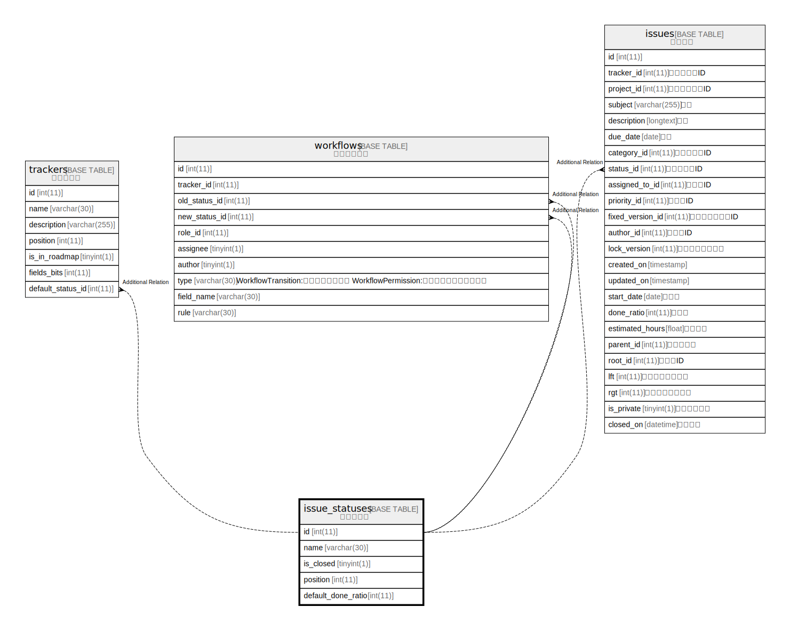

# issue_statuses

## 概要

ステータス

<details>
<summary><strong>テーブル定義</strong></summary>

```sql
CREATE TABLE `issue_statuses` (
  `id` int(11) NOT NULL AUTO_INCREMENT,
  `name` varchar(30) NOT NULL DEFAULT '',
  `is_closed` tinyint(1) NOT NULL DEFAULT 0,
  `position` int(11) DEFAULT NULL,
  `default_done_ratio` int(11) DEFAULT NULL,
  PRIMARY KEY (`id`),
  KEY `index_issue_statuses_on_position` (`position`),
  KEY `index_issue_statuses_on_is_closed` (`is_closed`)
) ENGINE=InnoDB DEFAULT CHARSET=utf8mb4
```

</details>

## カラム一覧

| 名前                 | タイプ         | デフォルト値       | NULL許可   | Extra Definition | 子テーブル                                                                 | 親テーブル      | コメント     |
| ------------------ | ----------- | ------------ | -------- | ---------------- | --------------------------------------------------------------------- | ---------- | -------- |
| id                 | int(11)     |              | false    | auto_increment   | [trackers](trackers.md) [workflows](workflows.md) [issues](issues.md) |            |          |
| name               | varchar(30) | ''           | false    |                  |                                                                       |            |          |
| is_closed          | tinyint(1)  | 0            | false    |                  |                                                                       |            |          |
| position           | int(11)     | NULL         | true     |                  |                                                                       |            |          |
| default_done_ratio | int(11)     | NULL         | true     |                  |                                                                       |            |          |

## 制約一覧

| 名前      | タイプ         | 定義               |
| ------- | ----------- | ---------------- |
| PRIMARY | PRIMARY KEY | PRIMARY KEY (id) |

## INDEX一覧

| 名前                                | 定義                                                            |
| --------------------------------- | ------------------------------------------------------------- |
| index_issue_statuses_on_is_closed | KEY index_issue_statuses_on_is_closed (is_closed) USING BTREE |
| index_issue_statuses_on_position  | KEY index_issue_statuses_on_position (position) USING BTREE   |
| PRIMARY                           | PRIMARY KEY (id) USING BTREE                                  |

## ER図



---

> Generated by [tbls](https://github.com/k1LoW/tbls)
