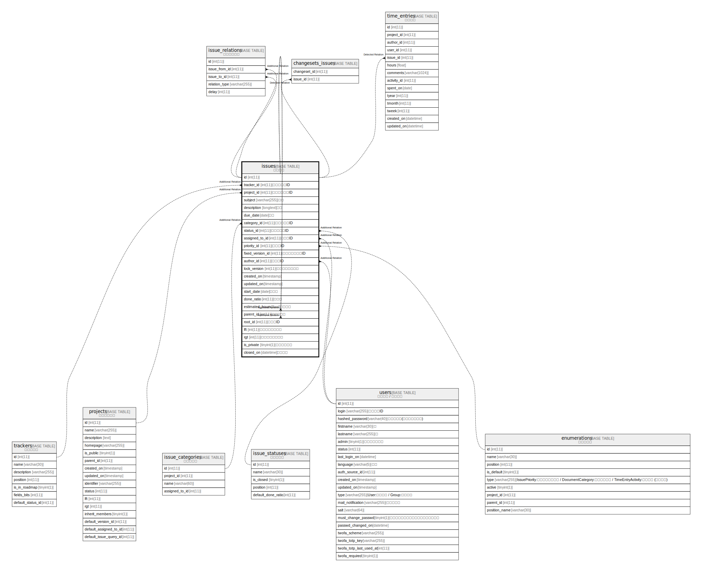

# issues

## 概要

チケット

<details>
<summary><strong>テーブル定義</strong></summary>

```sql
CREATE TABLE `issues` (
  `id` int(11) NOT NULL AUTO_INCREMENT,
  `tracker_id` int(11) NOT NULL,
  `project_id` int(11) NOT NULL,
  `subject` varchar(255) NOT NULL DEFAULT '',
  `description` longtext DEFAULT NULL,
  `due_date` date DEFAULT NULL,
  `category_id` int(11) DEFAULT NULL,
  `status_id` int(11) NOT NULL,
  `assigned_to_id` int(11) DEFAULT NULL,
  `priority_id` int(11) NOT NULL,
  `fixed_version_id` int(11) DEFAULT NULL,
  `author_id` int(11) NOT NULL,
  `lock_version` int(11) NOT NULL DEFAULT 0,
  `created_on` timestamp NULL DEFAULT NULL,
  `updated_on` timestamp NULL DEFAULT NULL,
  `start_date` date DEFAULT NULL,
  `done_ratio` int(11) NOT NULL DEFAULT 0,
  `estimated_hours` float DEFAULT NULL,
  `parent_id` int(11) DEFAULT NULL,
  `root_id` int(11) DEFAULT NULL,
  `lft` int(11) DEFAULT NULL,
  `rgt` int(11) DEFAULT NULL,
  `is_private` tinyint(1) NOT NULL DEFAULT 0,
  `closed_on` datetime DEFAULT NULL,
  PRIMARY KEY (`id`),
  KEY `issues_project_id` (`project_id`),
  KEY `index_issues_on_status_id` (`status_id`),
  KEY `index_issues_on_category_id` (`category_id`),
  KEY `index_issues_on_assigned_to_id` (`assigned_to_id`),
  KEY `index_issues_on_fixed_version_id` (`fixed_version_id`),
  KEY `index_issues_on_tracker_id` (`tracker_id`),
  KEY `index_issues_on_priority_id` (`priority_id`),
  KEY `index_issues_on_author_id` (`author_id`),
  KEY `index_issues_on_created_on` (`created_on`),
  KEY `index_issues_on_root_id_and_lft_and_rgt` (`root_id`,`lft`,`rgt`),
  KEY `index_issues_on_parent_id` (`parent_id`)
) ENGINE=InnoDB DEFAULT CHARSET=utf8mb4
```

</details>

## カラム一覧

| 名前               | タイプ          | デフォルト値       | NULL許可   | Extra Definition | 子テーブル                                                     | 親テーブル                                   | コメント             |
| ---------------- | ------------ | ------------ | -------- | ---------------- | --------------------------------------------------------- | --------------------------------------- | ---------------- |
| id               | int(11)      |              | false    | auto_increment   | [issues](issues.md) [issue_relations](issue_relations.md) |                                         |                  |
| tracker_id       | int(11)      |              | false    |                  |                                                           | [trackers](trackers.md)                 | トラッカーID          |
| project_id       | int(11)      |              | false    |                  |                                                           | [projects](projects.md)                 | プロジェクトID         |
| subject          | varchar(255) | ''           | false    |                  |                                                           |                                         | 題名               |
| description      | longtext     | NULL         | true     |                  |                                                           |                                         | 説明               |
| due_date         | date         | NULL         | true     |                  |                                                           |                                         | 期日               |
| category_id      | int(11)      | NULL         | true     |                  |                                                           | [issue_categories](issue_categories.md) | カテゴリーID          |
| status_id        | int(11)      |              | false    |                  |                                                           | [issue_statuses](issue_statuses.md)     | ステータスID          |
| assigned_to_id   | int(11)      | NULL         | true     |                  |                                                           | [users](users.md)                       | 担当者ID            |
| priority_id      | int(11)      |              | false    |                  |                                                           | [enumerations](enumerations.md)         | 優先度ID            |
| fixed_version_id | int(11)      | NULL         | true     |                  |                                                           |                                         | 対象バージョンID        |
| author_id        | int(11)      |              | false    |                  |                                                           | [users](users.md)                       | 登録者ID            |
| lock_version     | int(11)      | 0            | false    |                  |                                                           |                                         | ロックバージョン         |
| created_on       | timestamp    | NULL         | true     |                  |                                                           |                                         |                  |
| updated_on       | timestamp    | NULL         | true     |                  |                                                           |                                         |                  |
| start_date       | date         | NULL         | true     |                  |                                                           |                                         | 開始日              |
| done_ratio       | int(11)      | 0            | false    |                  |                                                           |                                         | 進捗率              |
| estimated_hours  | float        | NULL         | true     |                  |                                                           |                                         | 予定工数             |
| parent_id        | int(11)      | NULL         | true     |                  |                                                           | [issues](issues.md)                     | 親チケット            |
| root_id          | int(11)      | NULL         | true     |                  |                                                           | [issues](issues.md)                     | ルートID            |
| lft              | int(11)      | NULL         | true     |                  |                                                           |                                         | 左ノードポインタ         |
| rgt              | int(11)      | NULL         | true     |                  |                                                           |                                         | 右ノードポインタ         |
| is_private       | tinyint(1)   | 0            | false    |                  |                                                           |                                         | プライベート           |
| closed_on        | datetime     | NULL         | true     |                  |                                                           |                                         | 完了日時             |

## 制約一覧

| 名前      | タイプ         | 定義               |
| ------- | ----------- | ---------------- |
| PRIMARY | PRIMARY KEY | PRIMARY KEY (id) |

## INDEX一覧

| 名前                                      | 定義                                                                          |
| --------------------------------------- | --------------------------------------------------------------------------- |
| index_issues_on_assigned_to_id          | KEY index_issues_on_assigned_to_id (assigned_to_id) USING BTREE             |
| index_issues_on_author_id               | KEY index_issues_on_author_id (author_id) USING BTREE                       |
| index_issues_on_category_id             | KEY index_issues_on_category_id (category_id) USING BTREE                   |
| index_issues_on_created_on              | KEY index_issues_on_created_on (created_on) USING BTREE                     |
| index_issues_on_fixed_version_id        | KEY index_issues_on_fixed_version_id (fixed_version_id) USING BTREE         |
| index_issues_on_parent_id               | KEY index_issues_on_parent_id (parent_id) USING BTREE                       |
| index_issues_on_priority_id             | KEY index_issues_on_priority_id (priority_id) USING BTREE                   |
| index_issues_on_root_id_and_lft_and_rgt | KEY index_issues_on_root_id_and_lft_and_rgt (root_id, lft, rgt) USING BTREE |
| index_issues_on_status_id               | KEY index_issues_on_status_id (status_id) USING BTREE                       |
| index_issues_on_tracker_id              | KEY index_issues_on_tracker_id (tracker_id) USING BTREE                     |
| issues_project_id                       | KEY issues_project_id (project_id) USING BTREE                              |
| PRIMARY                                 | PRIMARY KEY (id) USING BTREE                                                |

## ER図



---

> Generated by [tbls](https://github.com/k1LoW/tbls)
