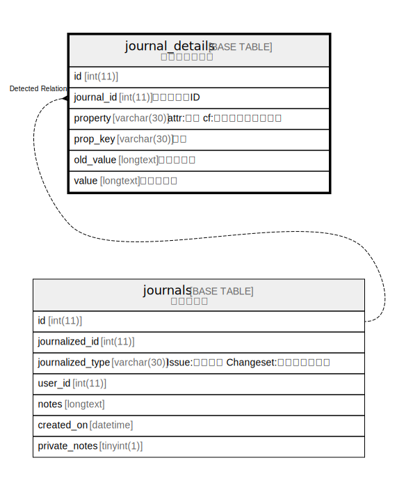

# journal_details

## 概要

<details>
<summary><strong>テーブル定義</strong></summary>

```sql
CREATE TABLE `journal_details` (
  `id` int(11) NOT NULL AUTO_INCREMENT,
  `journal_id` int(11) NOT NULL DEFAULT 0,
  `property` varchar(30) NOT NULL DEFAULT '',
  `prop_key` varchar(30) NOT NULL DEFAULT '',
  `old_value` longtext DEFAULT NULL,
  `value` longtext DEFAULT NULL,
  PRIMARY KEY (`id`),
  KEY `journal_details_journal_id` (`journal_id`)
) ENGINE=InnoDB DEFAULT CHARSET=utf8mb4
```

</details>

## カラム一覧

| 名前         | タイプ         | デフォルト値       | NULL許可   | Extra Definition | 子テーブル      | 親テーブル                   | コメント     |
| ---------- | ----------- | ------------ | -------- | ---------------- | ---------- | ----------------------- | -------- |
| id         | int(11)     |              | false    | auto_increment   |            |                         |          |
| journal_id | int(11)     | 0            | false    |                  |            | [journals](journals.md) |          |
| property   | varchar(30) | ''           | false    |                  |            |                         |          |
| prop_key   | varchar(30) | ''           | false    |                  |            |                         |          |
| old_value  | longtext    | NULL         | true     |                  |            |                         |          |
| value      | longtext    | NULL         | true     |                  |            |                         |          |

## 制約一覧

| 名前      | タイプ         | 定義               |
| ------- | ----------- | ---------------- |
| PRIMARY | PRIMARY KEY | PRIMARY KEY (id) |

## INDEX一覧

| 名前                         | 定義                                                      |
| -------------------------- | ------------------------------------------------------- |
| journal_details_journal_id | KEY journal_details_journal_id (journal_id) USING BTREE |
| PRIMARY                    | PRIMARY KEY (id) USING BTREE                            |

## ER図



---

> Generated by [tbls](https://github.com/k1LoW/tbls)
