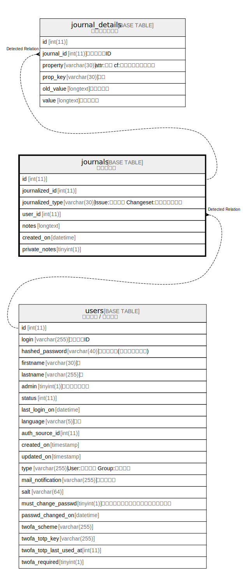

# journals

## 概要

<details>
<summary><strong>テーブル定義</strong></summary>

```sql
CREATE TABLE `journals` (
  `id` int(11) NOT NULL AUTO_INCREMENT,
  `journalized_id` int(11) NOT NULL DEFAULT 0,
  `journalized_type` varchar(30) NOT NULL DEFAULT '',
  `user_id` int(11) NOT NULL DEFAULT 0,
  `notes` longtext DEFAULT NULL,
  `created_on` datetime NOT NULL,
  `private_notes` tinyint(1) NOT NULL DEFAULT 0,
  PRIMARY KEY (`id`),
  KEY `journals_journalized_id` (`journalized_id`,`journalized_type`),
  KEY `index_journals_on_user_id` (`user_id`),
  KEY `index_journals_on_journalized_id` (`journalized_id`),
  KEY `index_journals_on_created_on` (`created_on`)
) ENGINE=InnoDB DEFAULT CHARSET=utf8mb4
```

</details>

## カラム一覧

| 名前               | タイプ         | デフォルト値       | NULL許可   | Extra Definition | 子テーブル                                 | 親テーブル             | コメント                                           |
| ---------------- | ----------- | ------------ | -------- | ---------------- | ------------------------------------- | ----------------- | ---------------------------------------------- |
| id               | int(11)     |              | false    | auto_increment   | [journal_details](journal_details.md) |                   |                                                |
| journalized_id   | int(11)     | 0            | false    |                  |                                       |                   |                                                |
| journalized_type | varchar(30) | ''           | false    |                  |                                       |                   | Issue:チケット<br>Changeset:チェンジセット<br>            |
| user_id          | int(11)     | 0            | false    |                  |                                       | [users](users.md) |                                                |
| notes            | longtext    | NULL         | true     |                  |                                       |                   |                                                |
| created_on       | datetime    |              | false    |                  |                                       |                   |                                                |
| private_notes    | tinyint(1)  | 0            | false    |                  |                                       |                   |                                                |

## 制約一覧

| 名前      | タイプ         | 定義               |
| ------- | ----------- | ---------------- |
| PRIMARY | PRIMARY KEY | PRIMARY KEY (id) |

## INDEX一覧

| 名前                               | 定義                                                                         |
| -------------------------------- | -------------------------------------------------------------------------- |
| index_journals_on_created_on     | KEY index_journals_on_created_on (created_on) USING BTREE                  |
| index_journals_on_journalized_id | KEY index_journals_on_journalized_id (journalized_id) USING BTREE          |
| index_journals_on_user_id        | KEY index_journals_on_user_id (user_id) USING BTREE                        |
| journals_journalized_id          | KEY journals_journalized_id (journalized_id, journalized_type) USING BTREE |
| PRIMARY                          | PRIMARY KEY (id) USING BTREE                                               |

## ER図



---

> Generated by [tbls](https://github.com/k1LoW/tbls)
