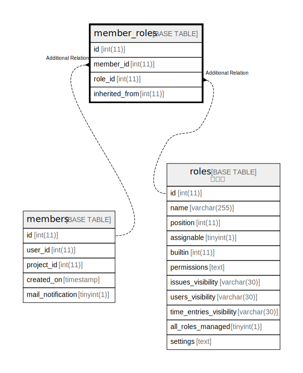

# member_roles

## 概要

メンバー⇔ロール

<details>
<summary><strong>テーブル定義</strong></summary>

```sql
CREATE TABLE `member_roles` (
  `id` int(11) NOT NULL AUTO_INCREMENT,
  `member_id` int(11) NOT NULL,
  `role_id` int(11) NOT NULL,
  `inherited_from` int(11) DEFAULT NULL,
  PRIMARY KEY (`id`),
  KEY `index_member_roles_on_member_id` (`member_id`),
  KEY `index_member_roles_on_role_id` (`role_id`),
  KEY `index_member_roles_on_inherited_from` (`inherited_from`)
) ENGINE=InnoDB DEFAULT CHARSET=utf8mb4
```

</details>

## カラム一覧

| 名前             | タイプ     | デフォルト値       | NULL許可   | Extra Definition | 子テーブル      | 親テーブル                 | コメント     |
| -------------- | ------- | ------------ | -------- | ---------------- | ---------- | --------------------- | -------- |
| id             | int(11) |              | false    | auto_increment   |            |                       |          |
| member_id      | int(11) |              | false    |                  |            | [members](members.md) |          |
| role_id        | int(11) |              | false    |                  |            | [roles](roles.md)     |          |
| inherited_from | int(11) | NULL         | true     |                  |            |                       |          |

## 制約一覧

| 名前      | タイプ         | 定義               |
| ------- | ----------- | ---------------- |
| PRIMARY | PRIMARY KEY | PRIMARY KEY (id) |

## INDEX一覧

| 名前                                   | 定義                                                                    |
| ------------------------------------ | --------------------------------------------------------------------- |
| index_member_roles_on_inherited_from | KEY index_member_roles_on_inherited_from (inherited_from) USING BTREE |
| index_member_roles_on_member_id      | KEY index_member_roles_on_member_id (member_id) USING BTREE           |
| index_member_roles_on_role_id        | KEY index_member_roles_on_role_id (role_id) USING BTREE               |
| PRIMARY                              | PRIMARY KEY (id) USING BTREE                                          |

## ER図



---

> Generated by [tbls](https://github.com/k1LoW/tbls)
