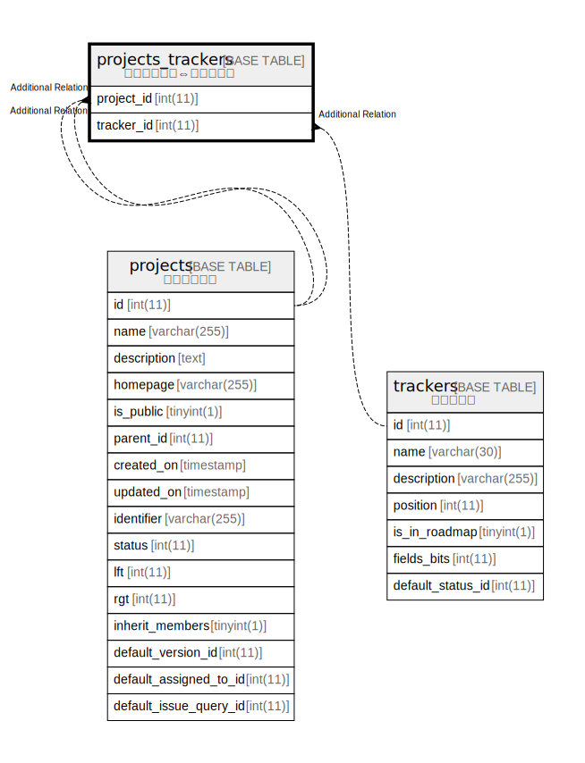

# projects_trackers

## 概要

プロジェクト⇔トラッカー

<details>
<summary><strong>テーブル定義</strong></summary>

```sql
CREATE TABLE `projects_trackers` (
  `project_id` int(11) NOT NULL DEFAULT 0,
  `tracker_id` int(11) NOT NULL DEFAULT 0,
  UNIQUE KEY `projects_trackers_unique` (`project_id`,`tracker_id`),
  KEY `projects_trackers_project_id` (`project_id`)
) ENGINE=InnoDB DEFAULT CHARSET=utf8mb4
```

</details>

## カラム一覧

| 名前         | タイプ     | デフォルト値       | NULL許可   | 子テーブル      | 親テーブル                   | コメント     |
| ---------- | ------- | ------------ | -------- | ---------- | ----------------------- | -------- |
| project_id | int(11) | 0            | false    |            | [projects](projects.md) |          |
| tracker_id | int(11) | 0            | false    |            | [trackers](trackers.md) |          |

## 制約一覧

| 名前                       | タイプ    | 定義                                                           |
| ------------------------ | ------ | ------------------------------------------------------------ |
| projects_trackers_unique | UNIQUE | UNIQUE KEY projects_trackers_unique (project_id, tracker_id) |

## INDEX一覧

| 名前                           | 定義                                                                       |
| ---------------------------- | ------------------------------------------------------------------------ |
| projects_trackers_project_id | KEY projects_trackers_project_id (project_id) USING BTREE                |
| projects_trackers_unique     | UNIQUE KEY projects_trackers_unique (project_id, tracker_id) USING BTREE |

## ER図



---

> Generated by [tbls](https://github.com/k1LoW/tbls)
