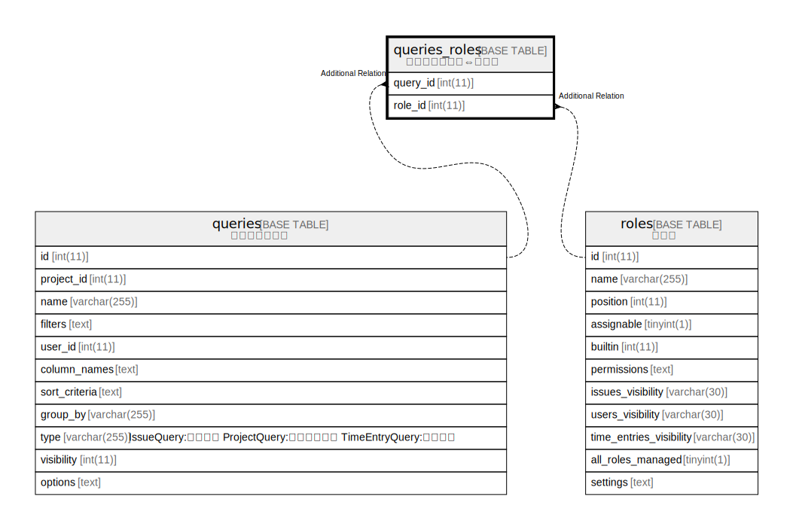

# queries_roles

## 概要

カスタムクエリ⇔ロール

<details>
<summary><strong>テーブル定義</strong></summary>

```sql
CREATE TABLE `queries_roles` (
  `query_id` int(11) NOT NULL,
  `role_id` int(11) NOT NULL,
  UNIQUE KEY `queries_roles_ids` (`query_id`,`role_id`)
) ENGINE=InnoDB DEFAULT CHARSET=utf8mb4
```

</details>

## カラム一覧

| 名前       | タイプ     | デフォルト値       | NULL許可   | 子テーブル      | 親テーブル                 | コメント     |
| -------- | ------- | ------------ | -------- | ---------- | --------------------- | -------- |
| query_id | int(11) |              | false    |            | [queries](queries.md) |          |
| role_id  | int(11) |              | false    |            | [roles](roles.md)     |          |

## 制約一覧

| 名前                | タイプ    | 定義                                               |
| ----------------- | ------ | ------------------------------------------------ |
| queries_roles_ids | UNIQUE | UNIQUE KEY queries_roles_ids (query_id, role_id) |

## INDEX一覧

| 名前                | 定義                                                           |
| ----------------- | ------------------------------------------------------------ |
| queries_roles_ids | UNIQUE KEY queries_roles_ids (query_id, role_id) USING BTREE |

## ER図



---

> Generated by [tbls](https://github.com/k1LoW/tbls)
