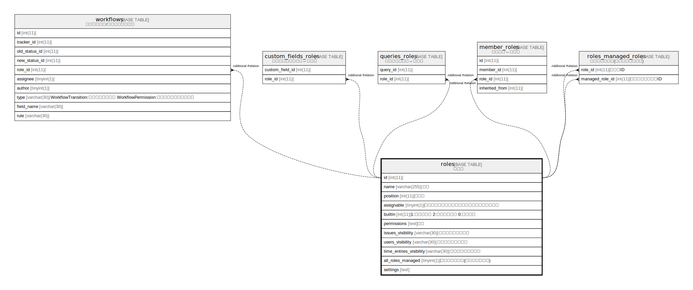

# roles

## 概要

ロール

<details>
<summary><strong>テーブル定義</strong></summary>

```sql
CREATE TABLE `roles` (
  `id` int(11) NOT NULL AUTO_INCREMENT,
  `name` varchar(255) NOT NULL DEFAULT '',
  `position` int(11) DEFAULT NULL,
  `assignable` tinyint(1) DEFAULT 1,
  `builtin` int(11) NOT NULL DEFAULT 0,
  `permissions` text DEFAULT NULL,
  `issues_visibility` varchar(30) NOT NULL DEFAULT 'default',
  `users_visibility` varchar(30) NOT NULL DEFAULT 'all',
  `time_entries_visibility` varchar(30) NOT NULL DEFAULT 'all',
  `all_roles_managed` tinyint(1) NOT NULL DEFAULT 1,
  `settings` text DEFAULT NULL,
  PRIMARY KEY (`id`)
) ENGINE=InnoDB AUTO_INCREMENT=[Redacted by tbls] DEFAULT CHARSET=utf8mb4
```

</details>

## カラム一覧

| 名前                      | タイプ          | デフォルト値       | NULL許可   | Extra Definition | 子テーブル                                                                                                                                                                                   | 親テーブル      | コメント     |
| ----------------------- | ------------ | ------------ | -------- | ---------------- | --------------------------------------------------------------------------------------------------------------------------------------------------------------------------------------- | ---------- | -------- |
| id                      | int(11)      |              | false    | auto_increment   | [workflows](workflows.md) [custom_fields_roles](custom_fields_roles.md) [queries_roles](queries_roles.md) [member_roles](member_roles.md) [roles_managed_roles](roles_managed_roles.md) |            |          |
| name                    | varchar(255) | ''           | false    |                  |                                                                                                                                                                                         |            |          |
| position                | int(11)      | NULL         | true     |                  |                                                                                                                                                                                         |            |          |
| assignable              | tinyint(1)   | 1            | true     |                  |                                                                                                                                                                                         |            |          |
| builtin                 | int(11)      | 0            | false    |                  |                                                                                                                                                                                         |            |          |
| permissions             | text         | NULL         | true     |                  |                                                                                                                                                                                         |            |          |
| issues_visibility       | varchar(30)  | 'default'    | false    |                  |                                                                                                                                                                                         |            |          |
| users_visibility        | varchar(30)  | 'all'        | false    |                  |                                                                                                                                                                                         |            |          |
| time_entries_visibility | varchar(30)  | 'all'        | false    |                  |                                                                                                                                                                                         |            |          |
| all_roles_managed       | tinyint(1)   | 1            | false    |                  |                                                                                                                                                                                         |            |          |
| settings                | text         | NULL         | true     |                  |                                                                                                                                                                                         |            |          |

## 制約一覧

| 名前      | タイプ         | 定義               |
| ------- | ----------- | ---------------- |
| PRIMARY | PRIMARY KEY | PRIMARY KEY (id) |

## INDEX一覧

| 名前      | 定義                           |
| ------- | ---------------------------- |
| PRIMARY | PRIMARY KEY (id) USING BTREE |

## ER図



---

> Generated by [tbls](https://github.com/k1LoW/tbls)
