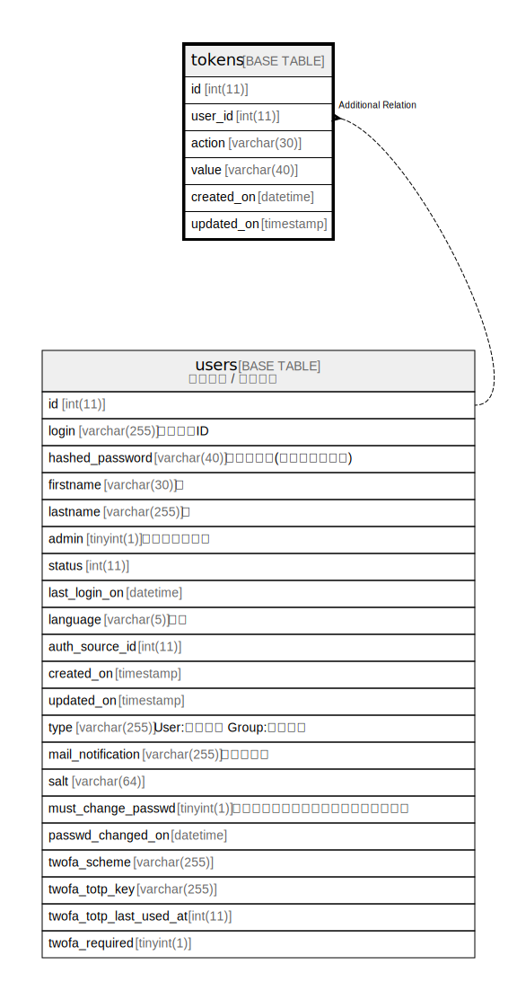

# tokens

## 概要

各種トークン

<details>
<summary><strong>テーブル定義</strong></summary>

```sql
CREATE TABLE `tokens` (
  `id` int(11) NOT NULL AUTO_INCREMENT,
  `user_id` int(11) NOT NULL DEFAULT 0,
  `action` varchar(30) NOT NULL DEFAULT '',
  `value` varchar(40) NOT NULL DEFAULT '',
  `created_on` datetime NOT NULL,
  `updated_on` timestamp NULL DEFAULT NULL,
  PRIMARY KEY (`id`),
  UNIQUE KEY `tokens_value` (`value`),
  KEY `index_tokens_on_user_id` (`user_id`)
) ENGINE=InnoDB AUTO_INCREMENT=[Redacted by tbls] DEFAULT CHARSET=utf8mb4
```

</details>

## カラム一覧

| 名前         | タイプ         | デフォルト値       | NULL許可   | Extra Definition | 子テーブル      | 親テーブル             | コメント                                                                    |
| ---------- | ----------- | ------------ | -------- | ---------------- | ---------- | ----------------- | ----------------------------------------------------------------------- |
| id         | int(11)     |              | false    | auto_increment   |            |                   |                                                                         |
| user_id    | int(11)     | 0            | false    |                  |            | [users](users.md) |                                                                         |
| action     | varchar(30) | ''           | false    |                  |            |                   | session:セッション<br>api:APIアクセスキー<br>feeds:Atomアクセスキー<br>                  |
| value      | varchar(40) | ''           | false    |                  |            |                   | トークン                                                                    |
| created_on | datetime    |              | false    |                  |            |                   |                                                                         |
| updated_on | timestamp   | NULL         | true     |                  |            |                   |                                                                         |

## 制約一覧

| 名前           | タイプ         | 定義                              |
| ------------ | ----------- | ------------------------------- |
| PRIMARY      | PRIMARY KEY | PRIMARY KEY (id)                |
| tokens_value | UNIQUE      | UNIQUE KEY tokens_value (value) |

## INDEX一覧

| 名前                      | 定義                                                |
| ----------------------- | ------------------------------------------------- |
| index_tokens_on_user_id | KEY index_tokens_on_user_id (user_id) USING BTREE |
| PRIMARY                 | PRIMARY KEY (id) USING BTREE                      |
| tokens_value            | UNIQUE KEY tokens_value (value) USING BTREE       |

## ER図



---

> Generated by [tbls](https://github.com/k1LoW/tbls)
