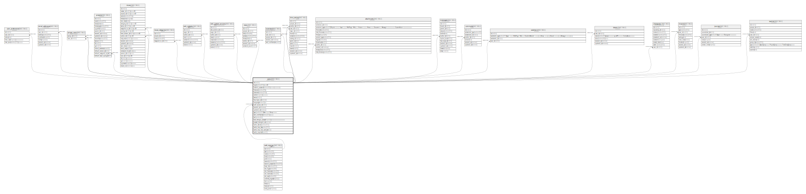

# users

## 概要

ユーザー / グループ

<details>
<summary><strong>テーブル定義</strong></summary>

```sql
CREATE TABLE `users` (
  `id` int(11) NOT NULL AUTO_INCREMENT,
  `login` varchar(255) NOT NULL DEFAULT '',
  `hashed_password` varchar(40) NOT NULL DEFAULT '',
  `firstname` varchar(30) NOT NULL DEFAULT '',
  `lastname` varchar(255) NOT NULL DEFAULT '',
  `admin` tinyint(1) NOT NULL DEFAULT 0,
  `status` int(11) NOT NULL DEFAULT 1,
  `last_login_on` datetime DEFAULT NULL,
  `language` varchar(5) DEFAULT '',
  `auth_source_id` int(11) DEFAULT NULL,
  `created_on` timestamp NULL DEFAULT NULL,
  `updated_on` timestamp NULL DEFAULT NULL,
  `type` varchar(255) DEFAULT NULL,
  `mail_notification` varchar(255) NOT NULL DEFAULT '',
  `salt` varchar(64) DEFAULT NULL,
  `must_change_passwd` tinyint(1) NOT NULL DEFAULT 0,
  `passwd_changed_on` datetime DEFAULT NULL,
  `twofa_scheme` varchar(255) DEFAULT NULL,
  `twofa_totp_key` varchar(255) DEFAULT NULL,
  `twofa_totp_last_used_at` int(11) DEFAULT NULL,
  `twofa_required` tinyint(1) DEFAULT 0,
  PRIMARY KEY (`id`),
  KEY `index_users_on_id_and_type` (`id`,`type`),
  KEY `index_users_on_auth_source_id` (`auth_source_id`),
  KEY `index_users_on_type` (`type`)
) ENGINE=InnoDB AUTO_INCREMENT=[Redacted by tbls] DEFAULT CHARSET=utf8mb4
```

</details>

## カラム一覧

| 名前                      | タイプ          | デフォルト値       | NULL許可   | Extra Definition | 子テーブル                                                                                                                                                                                                                                                                                                                                                                                                                                                                                                                                                                                 | 親テーブル                           | コメント                                 |
| ----------------------- | ------------ | ------------ | -------- | ---------------- | ------------------------------------------------------------------------------------------------------------------------------------------------------------------------------------------------------------------------------------------------------------------------------------------------------------------------------------------------------------------------------------------------------------------------------------------------------------------------------------------------------------------------------------------------------------------------------------- | ------------------------------- | ------------------------------------ |
| id                      | int(11)      |              | false    | auto_increment   | [user_preferences](user_preferences.md) [email_addresses](email_addresses.md) [groups_users](groups_users.md) [projects](projects.md) [issues](issues.md) [issue_categories](issue_categories.md) [wiki_contents](wiki_contents.md) [wiki_content_versions](wiki_content_versions.md) [news](news.md) [members](members.md) [time_entries](time_entries.md) [attachments](attachments.md) [messages](messages.md) [comments](comments.md) [watchers](watchers.md) [tokens](tokens.md) [changesets](changesets.md) [imports](imports.md) [journals](journals.md) [queries](queries.md) |                                 |                                      |
| login                   | varchar(255) | ''           | false    |                  |                                                                                                                                                                                                                                                                                                                                                                                                                                                                                                                                                                                       |                                 | ログインID                               |
| hashed_password         | varchar(40)  | ''           | false    |                  |                                                                                                                                                                                                                                                                                                                                                                                                                                                                                                                                                                                       |                                 | パスワード(ハッシュ化済み)                       |
| firstname               | varchar(30)  | ''           | false    |                  |                                                                                                                                                                                                                                                                                                                                                                                                                                                                                                                                                                                       |                                 | 名                                    |
| lastname                | varchar(255) | ''           | false    |                  |                                                                                                                                                                                                                                                                                                                                                                                                                                                                                                                                                                                       |                                 | 姓                                    |
| admin                   | tinyint(1)   | 0            | false    |                  |                                                                                                                                                                                                                                                                                                                                                                                                                                                                                                                                                                                       |                                 | システム管理者                              |
| status                  | int(11)      | 1            | false    |                  |                                                                                                                                                                                                                                                                                                                                                                                                                                                                                                                                                                                       |                                 |                                      |
| last_login_on           | datetime     | NULL         | true     |                  |                                                                                                                                                                                                                                                                                                                                                                                                                                                                                                                                                                                       |                                 |                                      |
| language                | varchar(5)   | ''           | true     |                  |                                                                                                                                                                                                                                                                                                                                                                                                                                                                                                                                                                                       |                                 | 言語                                   |
| auth_source_id          | int(11)      | NULL         | true     |                  |                                                                                                                                                                                                                                                                                                                                                                                                                                                                                                                                                                                       | [auth_sources](auth_sources.md) |                                      |
| created_on              | timestamp    | NULL         | true     |                  |                                                                                                                                                                                                                                                                                                                                                                                                                                                                                                                                                                                       |                                 |                                      |
| updated_on              | timestamp    | NULL         | true     |                  |                                                                                                                                                                                                                                                                                                                                                                                                                                                                                                                                                                                       |                                 |                                      |
| type                    | varchar(255) | NULL         | true     |                  |                                                                                                                                                                                                                                                                                                                                                                                                                                                                                                                                                                                       |                                 | User:ユーザー<br>Group:グループ<br>          |
| mail_notification       | varchar(255) | ''           | false    |                  |                                                                                                                                                                                                                                                                                                                                                                                                                                                                                                                                                                                       |                                 | メール通知                                |
| salt                    | varchar(64)  | NULL         | true     |                  |                                                                                                                                                                                                                                                                                                                                                                                                                                                                                                                                                                                       |                                 |                                      |
| must_change_passwd      | tinyint(1)   | 0            | false    |                  |                                                                                                                                                                                                                                                                                                                                                                                                                                                                                                                                                                                       |                                 | 次回ログイン時にパスワード変更を強制                   |
| passwd_changed_on       | datetime     | NULL         | true     |                  |                                                                                                                                                                                                                                                                                                                                                                                                                                                                                                                                                                                       |                                 |                                      |
| twofa_scheme            | varchar(255) | NULL         | true     |                  |                                                                                                                                                                                                                                                                                                                                                                                                                                                                                                                                                                                       |                                 |                                      |
| twofa_totp_key          | varchar(255) | NULL         | true     |                  |                                                                                                                                                                                                                                                                                                                                                                                                                                                                                                                                                                                       |                                 |                                      |
| twofa_totp_last_used_at | int(11)      | NULL         | true     |                  |                                                                                                                                                                                                                                                                                                                                                                                                                                                                                                                                                                                       |                                 |                                      |
| twofa_required          | tinyint(1)   | 0            | true     |                  |                                                                                                                                                                                                                                                                                                                                                                                                                                                                                                                                                                                       |                                 |                                      |

## 制約一覧

| 名前      | タイプ         | 定義               |
| ------- | ----------- | ---------------- |
| PRIMARY | PRIMARY KEY | PRIMARY KEY (id) |

## INDEX一覧

| 名前                            | 定義                                                             |
| ----------------------------- | -------------------------------------------------------------- |
| index_users_on_auth_source_id | KEY index_users_on_auth_source_id (auth_source_id) USING BTREE |
| index_users_on_id_and_type    | KEY index_users_on_id_and_type (id, type) USING BTREE          |
| index_users_on_type           | KEY index_users_on_type (type) USING BTREE                     |
| PRIMARY                       | PRIMARY KEY (id) USING BTREE                                   |

## ER図



---

> Generated by [tbls](https://github.com/k1LoW/tbls)
