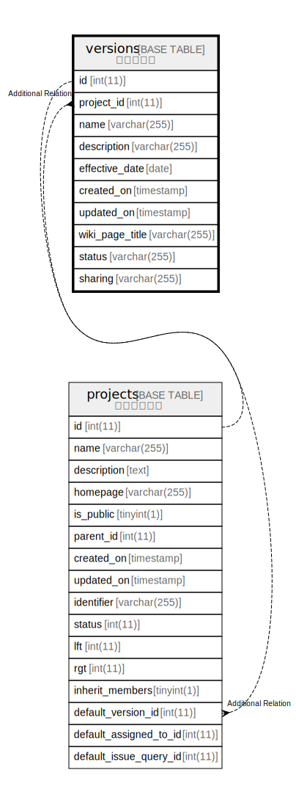

# versions

## 概要

バージョン

<details>
<summary><strong>テーブル定義</strong></summary>

```sql
CREATE TABLE `versions` (
  `id` int(11) NOT NULL AUTO_INCREMENT,
  `project_id` int(11) NOT NULL DEFAULT 0,
  `name` varchar(255) NOT NULL DEFAULT '',
  `description` varchar(255) DEFAULT '',
  `effective_date` date DEFAULT NULL,
  `created_on` timestamp NULL DEFAULT NULL,
  `updated_on` timestamp NULL DEFAULT NULL,
  `wiki_page_title` varchar(255) DEFAULT NULL,
  `status` varchar(255) DEFAULT 'open',
  `sharing` varchar(255) NOT NULL DEFAULT 'none',
  PRIMARY KEY (`id`),
  KEY `versions_project_id` (`project_id`),
  KEY `index_versions_on_sharing` (`sharing`)
) ENGINE=InnoDB DEFAULT CHARSET=utf8mb4
```

</details>

## カラム一覧

| 名前              | タイプ          | デフォルト値       | NULL許可   | Extra Definition | 子テーブル                   | 親テーブル                   | コメント     |
| --------------- | ------------ | ------------ | -------- | ---------------- | ----------------------- | ----------------------- | -------- |
| id              | int(11)      |              | false    | auto_increment   | [projects](projects.md) |                         |          |
| project_id      | int(11)      | 0            | false    |                  |                         | [projects](projects.md) |          |
| name            | varchar(255) | ''           | false    |                  |                         |                         |          |
| description     | varchar(255) | ''           | true     |                  |                         |                         |          |
| effective_date  | date         | NULL         | true     |                  |                         |                         |          |
| created_on      | timestamp    | NULL         | true     |                  |                         |                         |          |
| updated_on      | timestamp    | NULL         | true     |                  |                         |                         |          |
| wiki_page_title | varchar(255) | NULL         | true     |                  |                         |                         |          |
| status          | varchar(255) | 'open'       | true     |                  |                         |                         |          |
| sharing         | varchar(255) | 'none'       | false    |                  |                         |                         |          |

## 制約一覧

| 名前      | タイプ         | 定義               |
| ------- | ----------- | ---------------- |
| PRIMARY | PRIMARY KEY | PRIMARY KEY (id) |

## INDEX一覧

| 名前                        | 定義                                                  |
| ------------------------- | --------------------------------------------------- |
| index_versions_on_sharing | KEY index_versions_on_sharing (sharing) USING BTREE |
| versions_project_id       | KEY versions_project_id (project_id) USING BTREE    |
| PRIMARY                   | PRIMARY KEY (id) USING BTREE                        |

## ER図



---

> Generated by [tbls](https://github.com/k1LoW/tbls)
