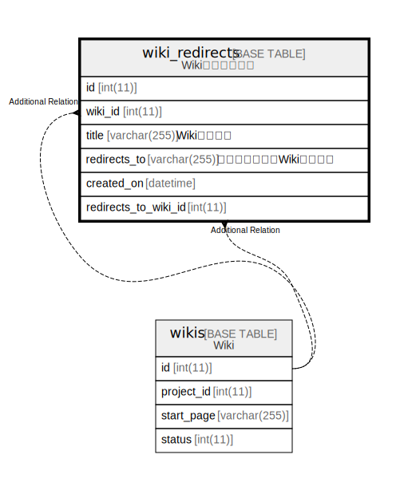

# wiki_redirects

## 概要

Wikiリダイレクト

<details>
<summary><strong>テーブル定義</strong></summary>

```sql
CREATE TABLE `wiki_redirects` (
  `id` int(11) NOT NULL AUTO_INCREMENT,
  `wiki_id` int(11) NOT NULL,
  `title` varchar(255) DEFAULT NULL,
  `redirects_to` varchar(255) DEFAULT NULL,
  `created_on` datetime NOT NULL,
  `redirects_to_wiki_id` int(11) NOT NULL,
  PRIMARY KEY (`id`),
  KEY `wiki_redirects_wiki_id_title` (`wiki_id`,`title`),
  KEY `index_wiki_redirects_on_wiki_id` (`wiki_id`)
) ENGINE=InnoDB AUTO_INCREMENT=[Redacted by tbls] DEFAULT CHARSET=utf8mb4
```

</details>

## カラム一覧

| 名前                   | タイプ          | デフォルト値       | NULL許可   | Extra Definition | 子テーブル      | 親テーブル             | コメント                       |
| -------------------- | ------------ | ------------ | -------- | ---------------- | ---------- | ----------------- | -------------------------- |
| id                   | int(11)      |              | false    | auto_increment   |            |                   |                            |
| wiki_id              | int(11)      |              | false    |                  |            | [wikis](wikis.md) |                            |
| title                | varchar(255) | NULL         | true     |                  |            |                   | Wikiページ名                   |
| redirects_to         | varchar(255) | NULL         | true     |                  |            |                   | リダイレクト先Wikiページ名            |
| created_on           | datetime     |              | false    |                  |            |                   |                            |
| redirects_to_wiki_id | int(11)      |              | false    |                  |            | [wikis](wikis.md) |                            |

## 制約一覧

| 名前      | タイプ         | 定義               |
| ------- | ----------- | ---------------- |
| PRIMARY | PRIMARY KEY | PRIMARY KEY (id) |

## INDEX一覧

| 名前                              | 定義                                                            |
| ------------------------------- | ------------------------------------------------------------- |
| index_wiki_redirects_on_wiki_id | KEY index_wiki_redirects_on_wiki_id (wiki_id) USING BTREE     |
| wiki_redirects_wiki_id_title    | KEY wiki_redirects_wiki_id_title (wiki_id, title) USING BTREE |
| PRIMARY                         | PRIMARY KEY (id) USING BTREE                                  |

## ER図



---

> Generated by [tbls](https://github.com/k1LoW/tbls)
