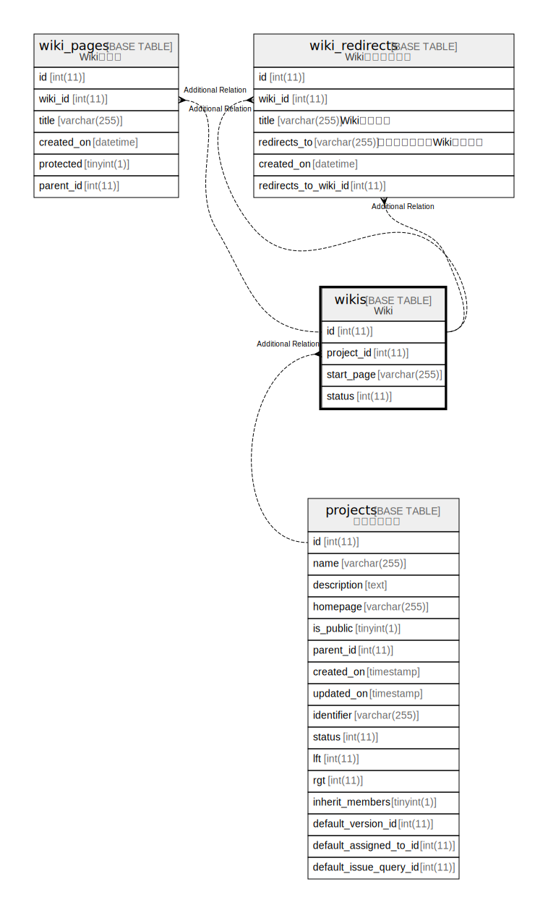

# wikis

## 概要

Wiki

<details>
<summary><strong>テーブル定義</strong></summary>

```sql
CREATE TABLE `wikis` (
  `id` int(11) NOT NULL AUTO_INCREMENT,
  `project_id` int(11) NOT NULL,
  `start_page` varchar(255) NOT NULL,
  `status` int(11) NOT NULL DEFAULT 1,
  PRIMARY KEY (`id`),
  KEY `wikis_project_id` (`project_id`)
) ENGINE=InnoDB DEFAULT CHARSET=utf8mb4 COLLATE=utf8mb4_general_ci
```

</details>

## カラム一覧

| 名前         | タイプ          | デフォルト値       | NULL許可   | Extra Definition | 子テーブル                                                           | 親テーブル                   | コメント     |
| ---------- | ------------ | ------------ | -------- | ---------------- | --------------------------------------------------------------- | ----------------------- | -------- |
| id         | int(11)      |              | false    | auto_increment   | [wiki_pages](wiki_pages.md) [wiki_redirects](wiki_redirects.md) |                         |          |
| project_id | int(11)      |              | false    |                  |                                                                 | [projects](projects.md) |          |
| start_page | varchar(255) |              | false    |                  |                                                                 |                         |          |
| status     | int(11)      | 1            | false    |                  |                                                                 |                         |          |

## 制約一覧

| 名前      | タイプ         | 定義               |
| ------- | ----------- | ---------------- |
| PRIMARY | PRIMARY KEY | PRIMARY KEY (id) |

## INDEX一覧

| 名前               | 定義                                            |
| ---------------- | --------------------------------------------- |
| wikis_project_id | KEY wikis_project_id (project_id) USING BTREE |
| PRIMARY          | PRIMARY KEY (id) USING BTREE                  |

## ER図



---

> Generated by [tbls](https://github.com/k1LoW/tbls)
